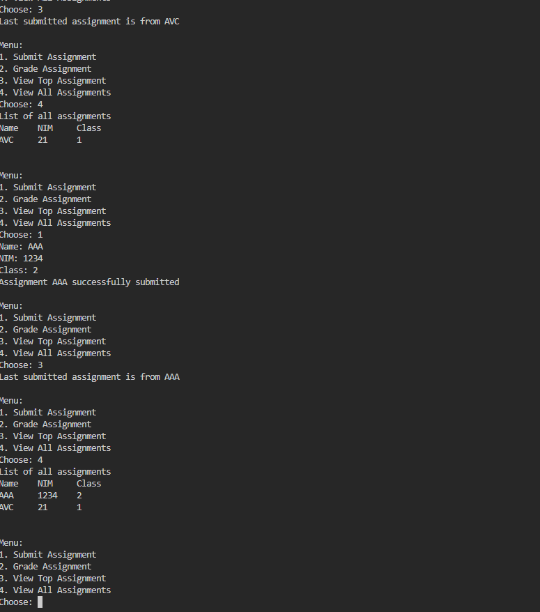
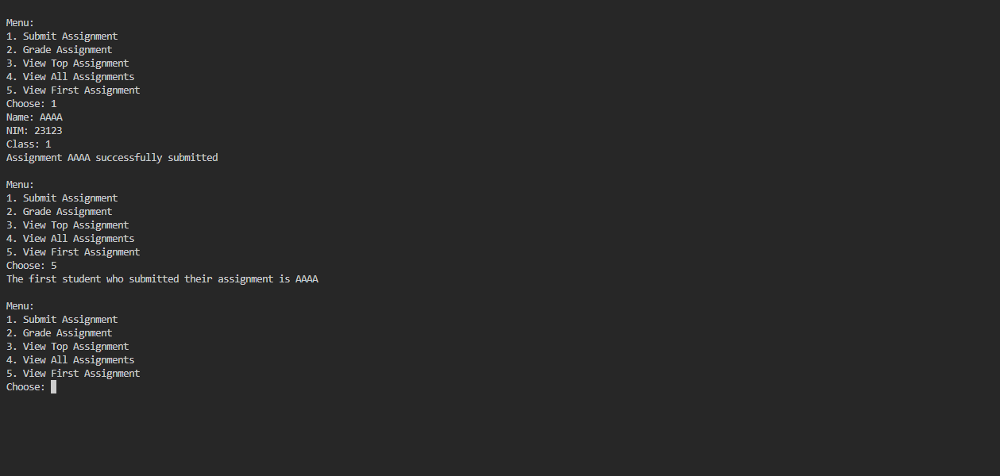
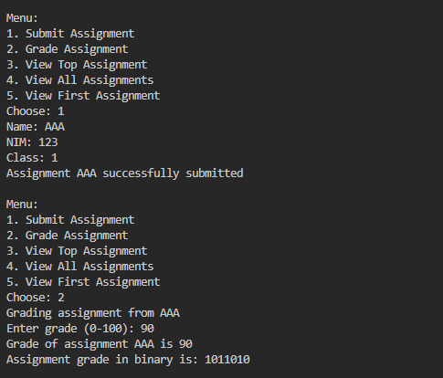
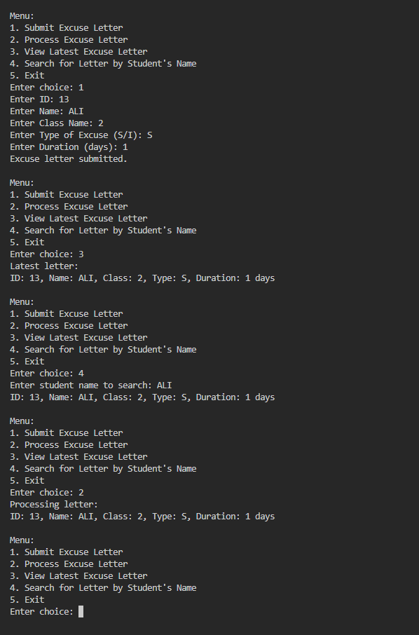

Labs Activities 

2.1.1

Student1.java : 

public class Student1 {

    String nama;
    String nim;
    String className;
    int grade;

    public Student1(String nama, String nim, String className, int grade) {
        this.nama = nama;
        this.nim = nim;
        this.className = className;
        this.grade = grade;
    }

    public void grading(int grade) {
        this.grade = grade;
    }
}

StudentAssignmentStack1.java:

public class StudentAssignmentStack1 {

    Student1[] stack;
    int top, size;

    public StudentAssignmentStack1(int size) {
        this.size = size;
        stack = new Student1[size];
        top = -1;
    }

    boolean isFull() {
        if (top == size - 1) {
            return true;
        } else {
            return false;
        }
    }

    boolean isEmpty() {
        if (top == -1) {
            return true;
        } else {
            return false;
        }
    }

    void push(Student1 std) {
        if (!isFull()) {
            stack[++top] = std;
        } else {
            System.out.println("Stack is full");
        }
    }

    Student1 pop() {
        if (!isEmpty()) {
            Student1 std = stack[top--];
            return std;
        } else {
            System.out.println("There is no data in the stack");
            return null;
        }
    }

    Student1 peek() {
        if (!isEmpty()) {
            return stack[top];
        } else {
            System.out.println("There is no data in the stack");
            return null;
        }
    }

    public void print() {
        for (int i = top; i >= 0; i--) {
            System.out.println(stack[i].nama + "\t" + stack[i].nim + "\t" + stack[i].className + "\t");
        }
        System.out.println("");
    }

//added a getFirst for Getting the first Students.
    public Student1 getFirst() {
        if (!isEmpty()) {
            return stack[0];
        } else {
            System.out.println("There is no data in the stack");
            return null;
        }
    }
}

StudentDemo1.java:

import java.util.Scanner;

public class StudentDemo1 {

    public static void main(String[] args) {
        StudentAssignmentStack1 stack = new StudentAssignmentStack1(5);
        Scanner scan = new Scanner(System.in);
        int choice;
        do {
            System.out.println("\nMenu:");
            System.out.println("1. Submit Assignment");
            System.out.println("2. Grade Assignment");
            System.out.println("3. View Top Assignment");
            System.out.println("4. View All Assignments");
            System.out.println("5. View First Assignment");
            System.out.print("Choose: ");
            choice = scan.nextInt();
            scan.nextLine();
            switch (choice) {
                case 1:
                    System.out.print("Name: ");
                    String nama = scan.nextLine();
                    System.out.print("NIM: ");
                    String nim = scan.nextLine();
                    System.out.print("Class: ");
                    String className = scan.nextLine();
                    Student1 student1 = new Student1(nama, nim, className, 0);
                    stack.push(student1);
                    System.out.printf("Assignment %s successfully submitted\n", student1.nama);
                    break;
                case 2:
                    Student1 graded = stack.pop();
                    if (graded != null) {
                        System.out.println("Grading assignment from " + graded.nama);
                        System.out.print("Enter grade (0-100): ");
                        int grade = scan.nextInt();
                        graded.grading(grade);
                        System.out.printf("Grade of assignment %s is %d\n", graded.nama, grade);
                    }
                    break;
                case 3:
                    Student1 view = stack.peek();
                    if (view != null) {
                        System.out.println("Last submitted assignment is from " + view.nama);
                    }
                    break;
                case 4:
                    System.out.println("List of all assignments");
                    System.out.println("Name\tNIM\tClass");
                    stack.print();
                    break;
                case 5:
                    Student1 first = stack.getFirst();
                    if (first != null) {
                        System.out.println("The first student who submitted their assignment is " + first.nama);
                    }
                    break;
                default:
                    System.out.println("Invalid choice.");
            }
        } while (choice >= 1 && choice <= 5);

    }

}

2.1.2

2.1.3

1. Explain the role of the stack data structure in the student assignment management system. Why 
was a stack used instead of another data structure (e.g., queue or list)? 

2. What is the difference between the push() and pop() methods in a stack, and how are they used 
in this program? 

3. Why is it important to check the condition !isFull() before calling the push() method? What could 
go wrong if this check is removed? 

4. How many student assignments can be stored in the current implementation of the stack? Provide 
the specific line of code or variable that determines this. 

5. Modify the existing stack implementation so that the system can also show the first student who 
submitted their assignment. Describe the changes you made in both StudentDemo and 
StudentAssignmentStack classes. 

6. Implement a method to count and return the number of assignments currently stored in the stack. 
Describe how your method works. 

7. What did you learn from this experiment about stack-based systems? Reflect on a real-world 
application where this kind of system might be useful. 

Answer : 

1. The stack manages student assignments by following a LIFO (Last In, First Out) order, facilitating efficient access to the most recent submission. It was chosen over a queue or list to prioritize processing the latest assignments first.

2. `push()` adds a student assignment to the top of the stack, while `pop()` removes and returns the top assignment. In this program, `push()` submits assignments, and `pop()` grades the latest one.

3. Checking `!isFull()` prevents adding an assignment when the stack is full, avoiding overflow errors. Without this check, new submissions could overwrite existing data, causing loss of information.

4. The current implementation of the stack can store up to `size` student assignments, which is determined by the line `public StudentAssignmentStack1(int size) {` in the `StudentAssignmentStack1` class.

5.     public Student1 getFirst() {
        if (!isEmpty()) {
            return stack[0];
        } else {
            System.out.println("There is no data in the stack");
            return null;
        }
    }

and adding Case 5 for FirstStudent Menu : 

                    Student1 first = stack.getFirst();
                    if (first != null) {
                        System.out.println("The first student who submitted their assignment is " + first.nama);
                    }

6.     public int getAssignmentCount() {
        return top + 1;
    }
}

7. I learned how the stack data structure operates on the Last In, First Out (LIFO) principle

2.2.1

public class ConversionStack {

    int[] binaryStack;
    int size;
    int top;

    public ConversionStack() {
        this.size = 32;
        binaryStack = new int[size];
        top = -1;
    }

    public boolean isEmpty() {
        return top == -1;
    }

    public boolean isFull() {
        return top == size - 1;
    }

    public void push(int data) {
        if (isFull()) {
            System.out.println("Stack is already full-filled!");
        } else {
            binaryStack[++top] = data;
        }
    }

    public int pop() {
        if (isEmpty()) {
            System.out.println("Stack is still empty!");
            return -1;
        } else {
            return binaryStack[top--];
        }
    }

    public String convertToBinary(int grade) {
        if (grade == 0) {
            return "0";
        }

        while (grade > 0) {
            int mod = grade % 2;
            push(mod);
            grade = grade / 2;
        }

        StringBuilder binary = new StringBuilder();
        while (!isEmpty()) {
            binary.append(pop());
        }
        return binary.toString();
    }
}

2.2.2

2.2.3

1. Explain the workflow of the convertToBinary() method. 

2. In the convertToBinary() method, change the loop condition to while (grade != 0). What is the result? Explain the reason! 

Answer : 

1. convertToBinary() method takes a regular number and turns it into binary by dividing it by 2 over and over. Each time, it keeps track of whether the remainder is 0 or 1, which builds up the binary digits. 

2. while (grade != 0), the loop would only run as long as grade isn’t 0. If grade starts out as 0, the loop won’t run at all, so it won’t do any work. 

2.4 Assignment

ExcuseLetter : 

public class ExcuseLetter {

    String id;
    String name;
    String className;
    char typeOfExcuse;
    int duration;

    public ExcuseLetter(String id, String name, String className, char typeOfExcuse, int duration) {
        this.id = id;
        this.name = name;
        this.className = className;
        this.typeOfExcuse = typeOfExcuse;
        this.duration = duration;
    }

    @Override
    public String toString() {
        return "ID: " + id + ", Name: " + name + ", Class: " + className
                + ", Type: " + typeOfExcuse + ", Duration: " + duration + " days";
    }
}

ExcuseLetterStack :

import java.util.Stack;

public class ExcuseLetterStack {

    private Stack<ExcuseLetter> stack;

    public ExcuseLetterStack() {
        stack = new Stack<>();
    }

    public void submitLetter(ExcuseLetter letter) {
        stack.push(letter);
    }

    public void processLetter() {
        if (!stack.isEmpty()) {
            ExcuseLetter letter = stack.pop();
            System.out.println("Processing letter:\n" + letter);
        } else {
            System.out.println("No excuse letters to process.");
        }
    }

    public void viewLatestLetter() {
        if (!stack.isEmpty()) {
            System.out.println("Latest letter:\n" + stack.peek());
        } else {
            System.out.println("No excuse letters available.");
        }
    }

    public void searchLetterByName(String name) {
        boolean found = false;
        for (ExcuseLetter letter : stack) {
            if (letter.name.equalsIgnoreCase(name)) {
                System.out.println(letter);
                found = true;
            }
        }
        if (!found) {
            System.out.println("No excuse letter found for student: " + name);
        }
    }
}

MainExcuseLetter : 

import java.util.Scanner;

public class MainExcuseLetter {

    public static void main(String[] args) {
        Scanner sc = new Scanner(System.in);
        ExcuseLetterStack letterStack = new ExcuseLetterStack();
        int choice;

        do {
            System.out.println("\nMenu:");
            System.out.println("1. Submit Excuse Letter");
            System.out.println("2. Process Excuse Letter");
            System.out.println("3. View Latest Excuse Letter");
            System.out.println("4. Search for Letter by Student's Name");
            System.out.println("5. Exit");
            System.out.print("Enter choice: ");
            choice = sc.nextInt();
            sc.nextLine();  // consume newline

            switch (choice) {
                case 1:
                    System.out.print("Enter ID: ");
                    String id = sc.nextLine();
                    System.out.print("Enter Name: ");
                    String name = sc.nextLine();
                    System.out.print("Enter Class Name: ");
                    String className = sc.nextLine();
                    System.out.print("Enter Type of Excuse (S/I): ");
                    char type = sc.nextLine().charAt(0);
                    System.out.print("Enter Duration (days): ");
                    int duration = sc.nextInt();
                    sc.nextLine();
                    ExcuseLetter letter = new ExcuseLetter(id, name, className, type, duration);
                    letterStack.submitLetter(letter);
                    System.out.println("Excuse letter submitted.");
                    break;
                case 2:
                    letterStack.processLetter();
                    break;
                case 3:
                    letterStack.viewLatestLetter();
                    break;
                case 4:
                    System.out.print("Enter student name to search: ");
                    String searchName = sc.nextLine();
                    letterStack.searchLetterByName(searchName);
                    break;
                case 5:
                    System.out.println("Exiting program.");
                    break;
                default:
                    System.out.println("Invalid choice. Please try again.");
            }
        } while (choice != 5);
    }
}

