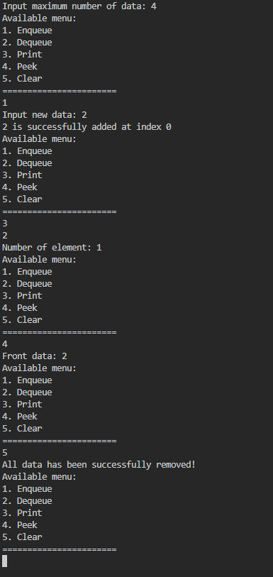
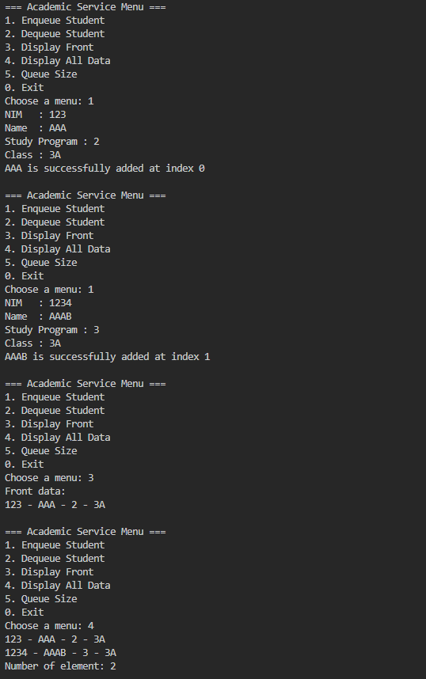
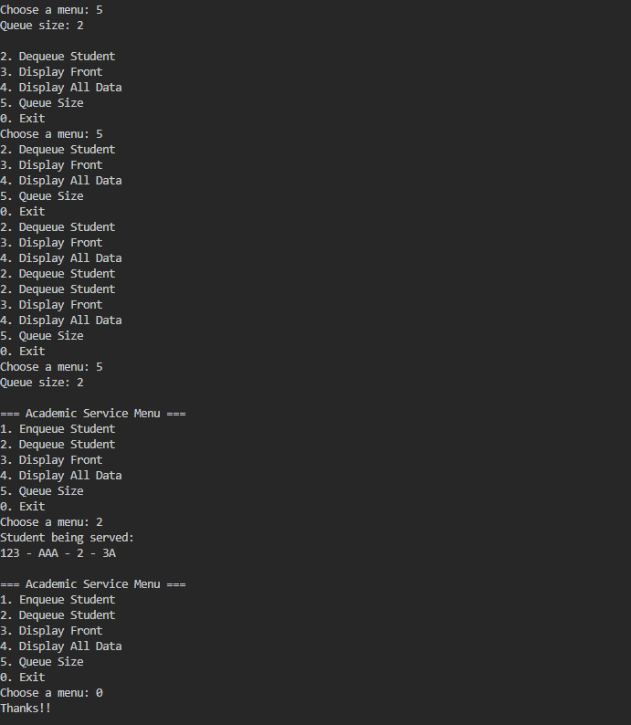
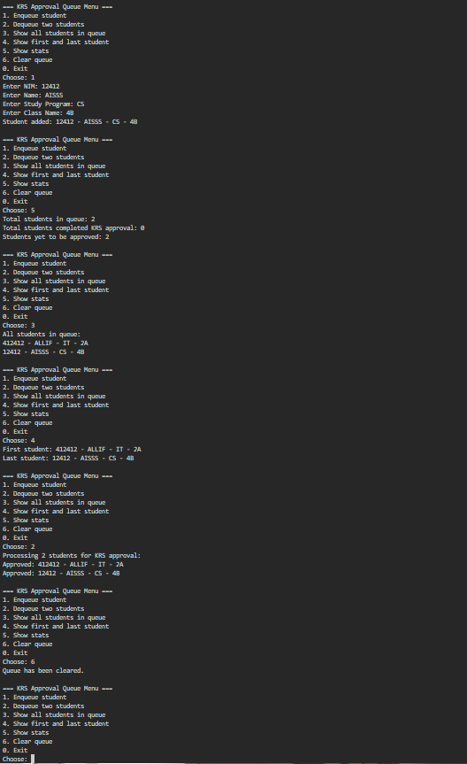

2.1.1

Queue : 

public class Queue {

    int[] data;
    int front, rear, size, max;

    public Queue(int n) {
        max = n;
        data = new int[max];
        size = 0;
        front = rear = -1;
    }

    boolean isEmpty() {
        if (size == 0) {
            return true;
        } else {
            return false;
        }
    }

    boolean isFull() {
        if (size == max) {
            return true;
        } else {
            return false;
        }
    }

    void peek() {
        if (!isEmpty()) {
            System.out.println("Front data: " + data[front]);
        } else {
            System.out.println("Queue is empty!!!");
        }
    }

    void print() {
        if (!isEmpty()) {
            int i = front;
            while (i != rear) {
                System.out.print(data[i] + " ");
                i = (i + 1) % max;
            }
            System.out.println(data[i] + " ");
            System.out.println("Number of element: " + size);
        } else {
            System.out.println("Queue is empty!!");
        }
    }

    void clear() {
        if (!isEmpty()) {
            front = rear = -1;
            size = 0;
            System.out.println("All data has been successfully removed!");
        } else {
            System.out.println("Queue is already empty!!!");
        }
    }

    void enqueue(int dt) {
        if (!isFull()) {
            if (isEmpty()) {
                front = rear = 0;
            } else {
                if (rear == max - 1) {
                    rear = 0;
                } else {
                    rear++;
                }
            }
            data[rear] = dt;
            size++;
            System.out.printf("%d is successfully added at index %d\n", dt, rear);
        } else {
            System.out.println("Queue is full!!!");
        }
    }

    int dequeue() {
        int dt = 0;
        if (!isEmpty()) {
            dt = data[front];
            size--;
            if (isEmpty()) {
                front = rear = -1;
            } else {
                if (front == max - 1) {
                    front = 0;
                } else {
                    front++;
                }
            }
        } else {
            System.out.println("Queue is empty!!!");
        }
        return dt;
    }

}

QueueMain : 

import java.util.Scanner;

public class QueueMain {

    static void menu() {
        System.out.println("Available menu:");
        System.out.println("1. Enqueue");
        System.out.println("2. Dequeue");
        System.out.println("3. Print");
        System.out.println("4. Peek");
        System.out.println("5. Clear");
        System.out.println("=======================");
    }

    public static void main(String[] args) {
        Scanner sc = new Scanner(System.in);
        System.out.print("Input maximum number of data: ");
        int n = sc.nextInt();
        Queue Q = new Queue(n);
        int choice = -1;
        do {
            menu();
            choice = sc.nextInt();
            switch (choice) {
                case 1:
                    System.out.print("Input new data: ");
                    int newData = sc.nextInt();
                    Q.enqueue(newData);
                    break;
                case 2:
                    int outData = Q.dequeue();
                    if (outData != 0) {
                        System.out.println("Removed data: " + outData);
                        break;
                    }
                case 3:
                    Q.print();
                    break;
                case 4:
                    Q.peek();
                    break;
                case 5:
                    Q.clear();
                    break;
            }
        } while (choice == 1 || choice == 2 || choice == 3 || choice == 4 || choice == 5);
    }
}

2.1.2

2.1.3 Question 

1. In the constructor, why are the initial values of the front and rear attributes set to -1, while the size attribute is set to 0?

2. In the Enqueue method, explain the meaning and purpose of the following code snippet!

    if (rear == max - 1) {
        rear = 0;
    }
3. In the Dequeue method, explain the meaning and purpose of the following code snippet!

    if (front == max - 1) {
    front = 0;
    }

4. In the print method, why does the loop variable i start from front instead of 0 (i.e., int i = 0)?

5. Review the print method again, and explain the meaning of the following code snippet!
    i = (i + 1) % max;

6. Show the code snippet that represents a queue overflow!

7. When a queue overflow or underflow occurs, the program continues to run and only displays informational text. Modify the program so that it stops when a queue overflow or underflow happens!

Answer : 

1. Initially, front and rear are set to -1 and size is set to 0, indicating the queue is empty.

2. When the rear index reaches the end of the array, it wraps around to 0 to add the next element to the beginning of the array.

3. When the front index reaches the end of the array, it wraps around to 0 to remove the next element from the beginning of the array.

4. The loop starts from the front to print the elements in the correct order.

5. The loop increments the index and wraps it around to the beginning of the array when it reaches the end.

6. The queue overflow code is `if (size == max) { System.out.println("Queue is full!!!"); }`.

7. To stop the program on overflow or underflow, add the following code to Enqueue and Dequeue methods:

    if (size == max) {
        System.out.println("Queue is full!!!");
        System.exit(0);
    }
    if (size == 0) {
        System.out.println("Queue is empty!!!");
        System.exit(0);
    }

2.2

Student1.java

StudentQueue.java

StudentQueueMain.java
2.2.1

Student1 : 

public class Student1 {

    String nim;
    String name;
    String studyProgram;
    String className;

    public Student1(String nim, String name, String studyProgram, String className) {
        this.nim = nim;
        this.name = name;
        this.studyProgram = studyProgram;
        this.className = className;
    }

    void print() {
        System.out.println(nim + " - " + name + " - " + studyProgram + " - " + className);
    }

}

StudentQueue : 

public class StudentQueue {

    Student1[] data;
    int front, rear, size, max;

    public StudentQueue(int n) {
        max = n;
        data = new Student1[max];
        size = 0;
        front = 0;
        rear = -1;
    }

    boolean isEmpty() {
        if (size == 0) {
            return true;
        } else {
            return false;
        }
    }

    boolean isFull() {
        if (size == max) {
            return true;
        } else {
            return false;
        }
    }

    void enqueue(Student1 dt) {
        if (isFull()) {
            System.out.println("Queue is full!!!");
            return;
        }
        rear = (rear + 1) % max;
        data[rear] = dt;
        size++;
        System.out.printf("%s is successfully added at index %d\n",
                dt.name, rear);
    }

    Student1 dequeue() {
        if (isEmpty()) {
            System.out.println("Queue is empty!!!");
            return null;
        }
        Student1 dt = data[front];
        front = (front + 1) % max;
        size--;
        return dt;
    }

    void peek() {
        if (!isEmpty()) {
            System.out.println("Front data: ");
            data[front].print();
        } else {
            System.out.println("Queue is empty!!!");
        }
    }

    void print() {
        if (isEmpty()) {
            System.out.println("Queue is empty!!!");
            return;
        }
        int i = front;
        while (i != rear) {
            data[i].print();
            i = (i + 1) % max;
        }
        data[i].print();
        System.out.println("Number of element: " + size);
    }

    void clear() {
        if (!isEmpty()) {
            front = rear = -1;
            size = 0;
            System.out.println("All data has been successfully removed!");
        } else {
            System.out.println("Queue is already empty!!!");
        }
    }
}

StudentQueueMain : 

import java.util.Scanner;

public class StudentQueueMain {

    public static void main(String[] args) {
        Scanner sc = new Scanner(System.in);
        StudentQueue queue = new StudentQueue(5);
        int choice;
        do {
            System.out.println("\n=== Academic Service Menu ===");
            System.out.println("1. Enqueue Student");
            System.out.println("2. Dequeue Student");
            System.out.println("3. Display Front");
            System.out.println("4. Display All Data");
            System.out.println("5. Queue Size");
            System.out.println("0. Exit");
            System.out.print("Choose a menu: ");
            choice = sc.nextInt();
            sc.nextLine();
            switch (choice) {
                case 1:
                    System.out.print("NIM   : ");
                    String nim = sc.nextLine();
                    System.out.print("Name  : ");
                    String name = sc.nextLine();
                    System.out.print("Study Program : ");
                    String studyProgram = sc.nextLine();
                    System.out.print("Class : ");
                    String className = sc.nextLine();
                    Student1 std = new Student1(nim, name, studyProgram,
                            className);
                    queue.enqueue(std);
                    break;
                case 2:
                    Student1 studentBeingServed = queue.dequeue();
                    if (studentBeingServed != null) {
                        System.out.println("Student being served:");
                        studentBeingServed.print();
                    }
                    break;
                case 3:
                    queue.peek();
                    break;
                case 4:
                    queue.print();
                    break;
                case 5:
                    System.out.println("Queue size: " + queue.size);
                    break;
                case 0:
                    System.out.println("Thanks!!");
                    break;
                default:
                    System.out.println("Invalid menu!!");
            }
        } while (choice != 0);
    }
}

2.2.2

2.2.3

1. What is the main difference between the Queue (experiment 1) and StudentQueue classes in 
terms of the data type they manage? Why is this change in data type important? 

2. How do the enqueue and dequeue methods in StudentQueue differ from those in Queue? 

3. Examine the constructor of the StudentQueue class: why is the front attribute initialized to 0, 
whereas in the Queue class from Experiment 1, the front attribute is initialized to -1? 

4. Modify the program by adding a new method called viewRear() in the StudentQueue class to check the queue element at the rear position. Also, update the menu in the 
StudentQueueMain class by adding option 6: “Check rear of the queue,” so that the viewRear() method can be invoked. 

Answer : 

1. StudentQueue manages Student1 objects instead of int, allowing more complex data about each student.

2. The enqueue and dequeue methods are similar to those in Queue, but handle Student1 objects instead of int.

3. The front attribute is initialized to 0 in the StudentQueue constructor since the first element of the array is at index 0.

4. StudentQueue: 

    void viewRear() {
        if (!isEmpty()) {
            System.out.println("Rear data: ");
            data[rear].print();
        } else {
            System.out.println("Queue is empty!!!");
        }
    }

    StudentQueueMain : 

                    case 6:
                    queue.viewRear();
                    break;

2.3 Assignment 

• Check if the queue is empty, check if the queue is full, and clear the queue. 
• Add a student to the queue (enqueue), and process the KRS approval (dequeue) – each 
approval session processes 2 students at a time (from the first two in the queue).
• Show all students in the queue, show the first two students in line, and show the last 
student in the queue. 
• Print the total number of students in the queue, print the number of students who have 
completed the KRS approval process. 
• The maximum queue size is 10, and each DPA can handle up to 30 students. Display the 
number of students who have not yet completed the KRS approval process. 
Draw the class diagram for the queue structure and implement all the required methods through a 
menu-based interface in the main function.

Answer  : 

Student1 : 

public class Student1 {

    String nim;
    String name;
    String studyProgram;
    String className;

    public Student1(String nim, String name, String studyProgram, String className) {
        this.nim = nim;
        this.name = name;
        this.studyProgram = studyProgram;
        this.className = className;
    }

    void print() {
        System.out.println(nim + " - " + name + " - " + studyProgram + " - " + className);
    }
}

KRSQueue : 

public class KRSQueue {

    private final int MAX_SIZE = 10;
    private Student1[] queue;
    private int front;
    private int rear;
    private int totalProcessed;

    public KRSQueue() {
        queue = new Student1[MAX_SIZE];
        front = 0;
        rear = 0;
        totalProcessed = 0;
    }

    public boolean isEmpty() {
        return front == rear;
    }

    public boolean isFull() {
        return rear == MAX_SIZE;
    }

    public void clear() {
        front = 0;
        rear = 0;
        totalProcessed = 0;
        System.out.println("Queue has been cleared.");
    }

    public void enqueue(Student1 s) {
        if (isFull()) {
            System.out.println("Queue is full. Cannot add student.");
        } else {
            queue[rear] = s;
            rear++;
            System.out.print("Student added: ");
            s.print();
        }
    }

    public void dequeueTwo() {
        int available = rear - front;
        if (available < 2) {
            System.out.println("Not enough students to process.");
        } else {
            System.out.println("Processing 2 students for KRS approval:");
            for (int i = 0; i < 2; i++) {
                Student1 s = queue[front];
                System.out.print("Approved: ");
                s.print();
                queue[front] = null;
                front++;
                totalProcessed++;
            }
        }
    }

    public void showAllStudents() {
        if (isEmpty()) {
            System.out.println("Queue is empty.");
            return;
        }
        System.out.println("All students in queue:");
        for (int i = front; i < rear; i++) {
            queue[i].print();
        }
    }

    public void showFirstTwo() {
        if (rear - front >= 1) {
            System.out.print("First student: ");
            queue[front].print();
        }
    }

    public void showLastStudent() {
        if (!isEmpty()) {
            System.out.print("Last student: ");
            queue[rear - 1].print();
        }
    }

    public void stats() {
        System.out.println("Total students in queue: " + (rear - front));
        System.out.println("Total students completed KRS approval: " + totalProcessed);
        System.out.println("Students yet to be approved: " + (rear - front));
    }
}

MAIN : 

import java.util.Scanner;

public class KRSMain {

    public static void main(String[] args) {
        Scanner scanner = new Scanner(System.in);
        KRSQueue krsQueue = new KRSQueue();
        int choice;

        do {
            System.out.println("\n=== KRS Approval Queue Menu ===");
            System.out.println("1. Enqueue student");
            System.out.println("2. Dequeue two students");
            System.out.println("3. Show all students in queue");
            System.out.println("4. Show first and last student");
            System.out.println("5. Show stats");
            System.out.println("6. Clear queue");
            System.out.println("0. Exit");
            System.out.print("Choose: ");
            choice = scanner.nextInt();
            scanner.nextLine();

            switch (choice) {
                case 1:
                    if (!krsQueue.isFull()) {
                        System.out.print("Enter NIM: ");
                        String nim = scanner.nextLine();
                        System.out.print("Enter Name: ");
                        String name = scanner.nextLine();
                        System.out.print("Enter Study Program: ");
                        String studyProgram = scanner.nextLine();
                        System.out.print("Enter Class Name: ");
                        String className = scanner.nextLine();

                        Student1 student = new Student1(nim, name, studyProgram, className);
                        krsQueue.enqueue(student);
                    } else {
                        System.out.println("Queue is full. Cannot add more students.");
                    }
                    break;
                case 2:
                    krsQueue.dequeueTwo();
                    break;
                case 3:
                    krsQueue.showAllStudents();
                    break;
                case 4:
                    krsQueue.showFirstTwo();
                    krsQueue.showLastStudent();
                    break;
                case 5:
                    krsQueue.stats();
                    break;
                case 6:
                    krsQueue.clear();
                    break;
                case 0:
                    System.out.println("Exiting program. Goodbye!");
                    break;
                default:
                    System.out.println("Invalid choice. Try again.");
            }

        } while (choice != 0);

        scanner.close();
    }
}

Result : 

