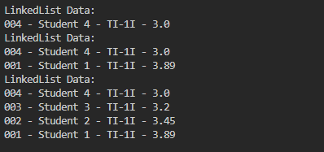
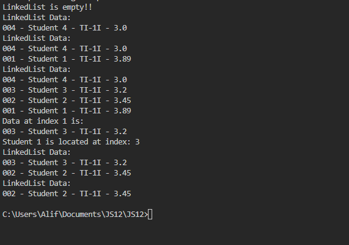
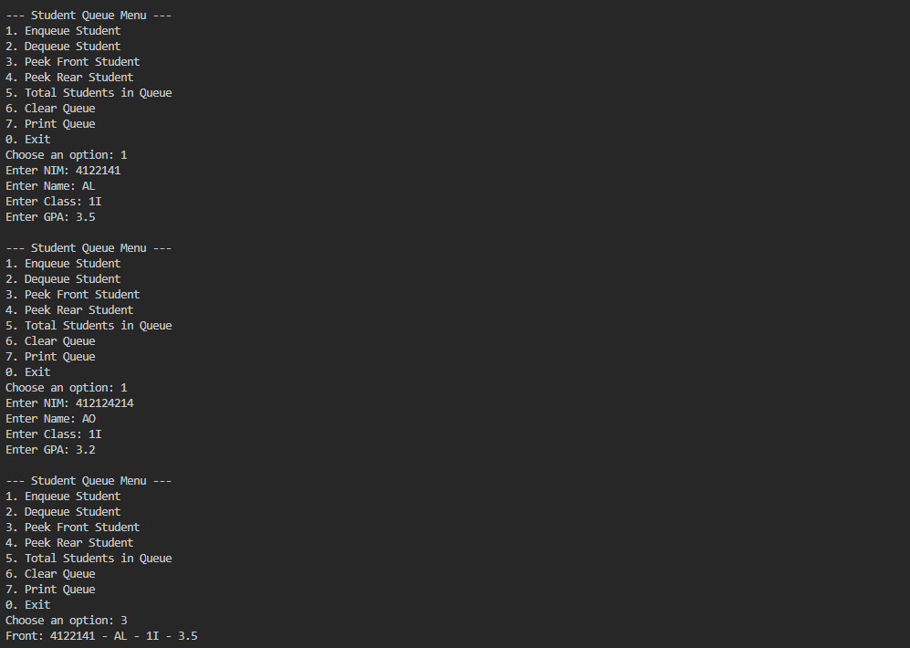
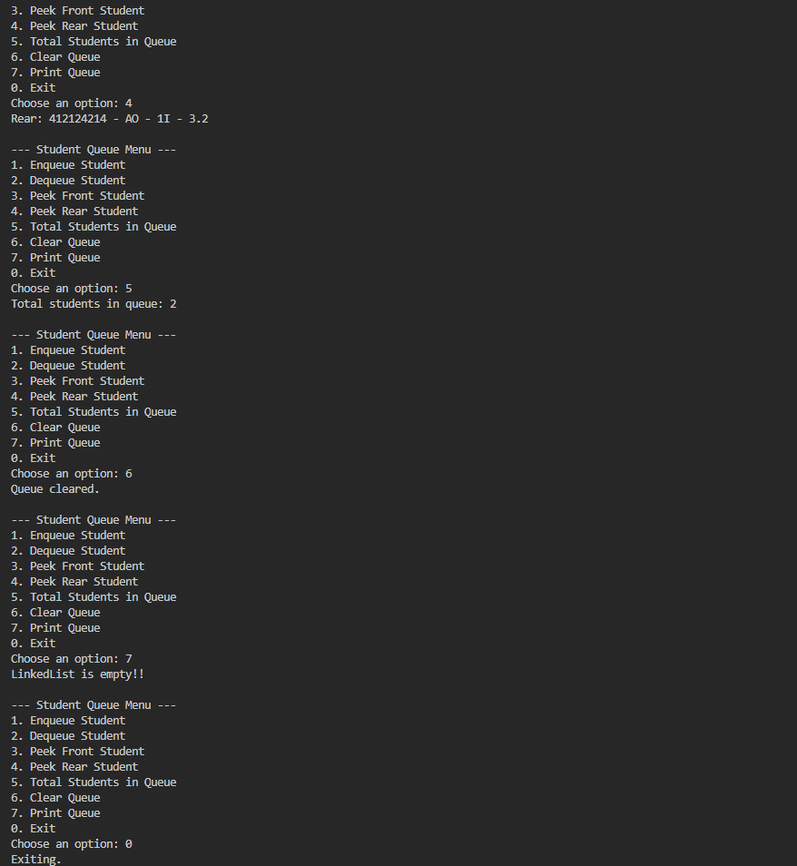

2.1 Experiment 1: Implementing Single Linked List 

Student1 Class : 

public class Student1 {

    String nim, name, className;
    double gpa;

    public Student1() {
    }

    public Student1(String nm, String nama, String kls, double ip) {
        nim = nm;
        name = nama;
        className = kls;
        gpa = ip;
    }

    void print() {
        System.out.println(nim + " - " + name + " - " + className + " - " + gpa);
    }
}

Node Class :

public class Node {

    Student1 data;
    Node next;

    public Node() {
    }

    public Node(Student1 data, Node next) {
        this.data = data;
        this.next = next;
    }
}

SingleLinkedList : 

public class SingleLinkedList {

    Node head;
    Node tail;

    boolean isEmpty() {
        return (head == null);
    }

    void print() {
        if (!isEmpty()) {
            Node tmp = head;
            System.out.println("LinkedList Data:");
            while (tmp != null) {
                tmp.data.print();
                tmp = tmp.next;
            }
        } else {
            System.out.println("LinkedList is empty!!");
        }
    }

    void addFirst(Student1 std) {
        Node newNode = new Node(std, null);
        if (isEmpty()) {
            head = newNode;
            tail = newNode;
        } else {
            newNode.next = head;
            head = newNode;
        }
    }

    void addLast(Student1 std) {
        Node newNode = new Node(std, null);
        if (isEmpty()) {
            head = newNode;
            tail = newNode;
        } else {
            tail.next = newNode;
            tail = newNode;
        }
    }

    void insertAfter(Student1 std, String key) {
        Node newNode = new Node(std, null);
        Node temp = head;
        do {
            if (temp.data.name.equalsIgnoreCase(key)) {
                newNode.next = temp.next;
                temp.next = newNode;
                if (newNode.next == null) {
                    tail = newNode;
                }
                break;
            }
            temp = temp.next;
        } while (temp != null);
    }

    public void insertAt(int index, Student1 std) {
        if (index < 0) {
            System.out.println("Wrong index!!");
        } else if (index == 0) {
            addFirst(std);
        } else {
            Node temp = head;
            for (int i = 0; i < index - 1; i++) {
                temp = temp.next;
            }
            temp.next = new Node(std, temp.next);
            if (temp.next.next == null) {
                tail = temp.next;
            }
        }
    }
}

LLMain : 

public class LLMain {

    public static void main(String[] args) {
        SingleLinkedList ThisisLinkedList = new SingleLinkedList();

        Student1 std1 = new Student1("001", "Student 1", "TI-1I", 3.89);
        Student1 std2 = new Student1("002", "Student 2", "TI-1I", 3.45);
        Student1 std3 = new Student1("003", "Student 3", "TI-1I", 3.20);
        Student1 std4 = new Student1("004", "Student 4", "TI-1I", 3.00);

        ThisisLinkedList.print();
        ThisisLinkedList.addFirst(std4);
        ThisisLinkedList.print();
        ThisisLinkedList.addLast(std1);
        ThisisLinkedList.print();
        ThisisLinkedList.insertAfter(std3, "Student 4");
        ThisisLinkedList.insertAt(2, std2);
        ThisisLinkedList.print();
    }

}

2.1.1 Output Verification

2.1.2 Questions!

1. Why does compiling the program code result in the message "Linked List is Empty" on the
first line?

2. Explain the general purpose of the variable temp in each method!

3. Modify the code so that data can be added via keyboard input!

4. What would happen if we did not use the tail attribute? Would it affect the code
implementation? Please explain.

Answer : 

1. The Linked List is initially empty when the program starts, so the message "Linked List is Empty" appears on the first line of the output.

2. The variable temp is used to traverse the Linked List in each method.

3. To add data with a keyboard input, the code should use the Scanner class to read input from the user and add it to the Linked List.

4. Not using the tail attribute would make it difficult to add and remove elements from the end of the list.

2.2.1

added some code to SingleLinkedList :

    Student1 getData(int idx) {
        if (isEmpty()) {
            System.out.println("LinkedList is empty!!");
            return null;
        }
        Node tmp = head;
        for (int i = 0; i < idx; i++) {
            tmp = tmp.next;
        }
        return tmp.data;
    }

    int indexOf(String key) {
        if (isEmpty()) {
            System.out.println("LinkedList is empty!!");
            return -1;
        }
        Node tmp = head;
        int idx = 0;
        while (tmp != null && !tmp.data.name.equalsIgnoreCase(key)) {
            tmp = tmp.next;
            idx++;
        }
        if (tmp == null) {
            return -1;
        } else {
            return idx;
        }
    }

    void removeFirst() {
        if (isEmpty()) {
            System.out.println("LinkedList is empty!!");
        } else if (head == tail) {
            head = tail = null;
        } else {
            head = head.next;
        }
    }

    void removeLast() {
        if (isEmpty()) {
            System.out.println("LinkedList is empty!!");
        } else if (head == tail) {
            head = tail = null;
        } else {
            Node tmp = head;
            while (tmp.next != tail) {
                tmp = tmp.next;
            }
            tmp.next = null;
            tail = tmp;
        }
    }

    public void remove(String key) {
        if (isEmpty()) {
            System.out.println("LinkedList is empty!!");
        } else {
            Node temp = head;
            while (temp != null) {
                if ((temp.data.name.equalsIgnoreCase(key)) && (temp
                        == head)) {
                    removeFirst();
                    break;
                } else if (temp.next.data.name.equalsIgnoreCase(key)) {
                    temp.next = temp.next.next;
                    if (temp.next == null) {
                        tail = temp;
                    }
                    break;
                }
                temp = temp.next;
            }
        }
    }

    public void removeAt(int index) {
        if (index == 0) {
            removeFirst();
        } else {
            Node temp = head;
            for (int i = 0; i < index - 1; i++) {
                temp = temp.next;
            }
            temp.next = temp.next.next;
            if (temp.next == null) {
                tail = temp;
            }
        }
    }

    and LLMain : 

           System.out.println("Data at index 1 is:");
        Student1 data = ThisisLinkedList.getData(1);
        data.print();

        int idx = ThisisLinkedList.indexOf("Student 1");
        System.out.println("Student 1 is located at index: " + idx);
        ThisisLinkedList.removeFirst();
        ThisisLinkedList.removeLast();
        ThisisLinkedList.print();
        ThisisLinkedList.removeAt(0);
        ThisisLinkedList.print();

2.2.2 Output verification

2.2.3 Questions

1. Why is the break keyword used in the remove function? Explain!

2. Explain the purpose of the code below in the remove method.

temp.next = temp.next.next;

if (temp.next == null) {

tail = temp;

}

Answer : 

1. The break keyword is used to stop the loop when the element about to be removed is found.

2. The code removes the element by linking the current node (temp) to the node after the next one (temp.next.next). If the next node is null, it will updates the tail to the current node (temp). This will ensures the tail always points to the last node.

3. Assignments

Create a queue-based program for student service operations with the following requirements:
a. Implement the queue using a Linked List-based Queue.

b. The program should be a new project, not a modification of an existing example.

c. When a student wants to join the queue, they must register their information.

d. Include functions to check if the queue is empty, check if it is full, and clear the queue.

e. Implement adding a student to the queue.

f. Implement calling the next student in the queue.

g. Display the first (front) and last (rear) student in the queue.

h. Display the total number of students still in the queue.

import java.util.Scanner;

public class StudentQueue1 {

    public static void main(String[] args) {
        Scanner sc = new Scanner(System.in);
        SingleLinkedList queue = new SingleLinkedList();
        int choice;

        do {
            System.out.println("\n--- Student Queue Menu ---");
            System.out.println("1. Enqueue Student");
            System.out.println("2. Dequeue Student");
            System.out.println("3. Peek Front Student");
            System.out.println("4. Peek Rear Student");
            System.out.println("5. Total Students in Queue");
            System.out.println("6. Clear Queue");
            System.out.println("7. Print Queue");
            System.out.println("0. Exit");
            System.out.print("Choose an option: ");
            choice = sc.nextInt();
            sc.nextLine();

            switch (choice) {
                case 1:
                    System.out.print("Enter NIM: ");
                    String nim = sc.nextLine();
                    System.out.print("Enter Name: ");
                    String name = sc.nextLine();
                    System.out.print("Enter Class: ");
                    String className = sc.nextLine();
                    System.out.print("Enter GPA: ");
                    double gpa = sc.nextDouble();
                    sc.nextLine();
                    Student1 s = new Student1(nim, name, className, gpa);
                    queue.addLast(s);
                    break;
                case 2:
                    queue.removeFirst();
                    break;
                case 3:
                    if (!queue.isEmpty()) {
                        System.out.print("Front: ");
                        queue.head.data.print();
                    } else {
                        System.out.println("Queue is empty.");
                    }
                    break;
                case 4:
                    if (!queue.isEmpty()) {
                        System.out.print("Rear: ");
                        queue.tail.data.print();
                    } else {
                        System.out.println("Queue is empty.");
                    }
                    break;
                case 5:
                    System.out.println("Total students in queue: " + queue.getSize());
                    break;
                case 6:
                    while (!queue.isEmpty()) {
                        queue.removeFirst();
                    }
                    System.out.println("Queue cleared.");
                    break;
                case 7:
                    queue.print();
                    break;
                case 0:
                    System.out.println("Exiting.");
                    break;
                default:
                    System.out.println("Invalid option.");
            }
        } while (choice != 0);
    }
}

added (getSize) to SingleLinkedList for Counting the Student Total in Queue
 
    public int getSize() {
        int count = 0;
        Node tmp = head;
        while (tmp != null) {
            count++;
            tmp = tmp.next;
        }
        return count;
    }

Result : 

