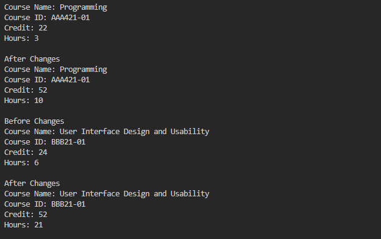
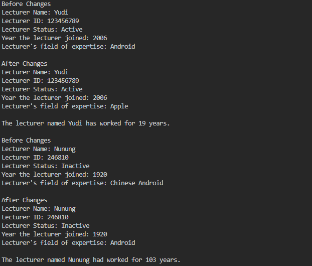

 LAB REPORT #2

 2.1.1 Declaration, Attribute and Method :

 public class Students1 {
    String name;
    String nim;
    double ipk;
    String kelas;

    void tampilkanInformasi() {
        System.out.println("Name: " + name);
        System.out.println("NIM: " + nim);
        System.out.println("IPK: " + ipk);
        System.out.println("Class: " + kelas);
    }

    void ubahKelas(String kelasBaru) {
        kelas = kelasBaru;
    }

    void updateIPK(double ipkBaru) {
        ipk = ipkBaru;
    }

    String nilaiKinerja() {
        if (ipk >= 3.5) {
            return "Good performance";
        } else if (ipk >= 3.0) {
            return "Fair performance";
        } else if (ipk >= 2.0) {
            return "Poor performance";
        } else {
            return "Very poor performance";
        }

    }
    
    public Students1 () {
    }
    
    public Students1 (String nm, String nim, double ipk, String kls)    {
        name = nm;  
        this.nim = nim;
        this.ipk = ipk;
        kelas = kls;
    }

}

 2.1.2 Experiments Verifications :

 It won't work because it's work Like class and only add attribute.

 2.1.3 Questions :

1. Mention two characteristics of a class or object!

2. How many attributes does the Student class have? List them!

3. How many methods does the Student class have? List them!

4. Modify the updateGPA() method to validate that the input IPK is within the range of 0.0 to
4.0. If it is out of range, display a message: "Invalid IPK. Must be between 0.0 and 4.0."

5. Explain how the evaluate() method evaluates student performance. What criteria does it use,
and what does it return?

6. Commit and push the code to GitHub.

Answer : 

1. A class encapsulates related data and behaviors, meaning it combines attributes and methods into one coherent structure, It provides abstraction by hiding the internal details and exposing only what is necessary through its methods.

2. name: Represents the student' name.

nim: Serves as the student identification number.

ipk: Stores the student' GPA.

kelas: Indicates the class or section the student belongs to.

3. The tampilkanInformasi() method is responsible for displaying the student' details.

The ubahKelas(String kelasBaru) method allows the student class to be updated.

The updateIPK(double ipkBaru) method is used to modify the student GPA, which should also validate that the GPA is within an acceptable range.

The nilaiKinerja() method evaluates the student performance based on their GPA, returning a descriptive performance rating.

In addition to these, the class has two constructors (one default and one parameterized) to create student objects.

4. The method now checks if the new GPA (ipkBaru) falls between 0.0 and 4.0.

If the value is out of this range, it prints a message: "Invalid IPK. Must be between 0.0 and 4.0."

Otherwise, it updates the ipk attribute with the new value.

5. This method assesses the student's performance by analyzing the ipk value.

It first checks if the GPA is 3.5 or higher, and if so, it returns "Good performance."

If the GPA is between 3.0 and 3.49, it returns "Fair performance."

If the GPA is between 2.0 and 2.99, it returns "Poor performance."

For any GPA below 2.0, the method returns "Very poor performance."

 2.2 Object Installation, then Accessing Atrribut and Method :

 public class StudentMain1 {

    public static void main(String[] args) {
        Students1 mhs1 = new Students1();
        mhs1.name = "ABC";
        mhs1.nim = "123";
        mhs1.ipk = 3.5;
        mhs1.kelas = "A";

        mhs1.tampilkanInformasi();
        mhs1.ubahKelas("SI 2K");
        mhs1.updateIPK(3.60);
        mhs1.tampilkanInformasi();
    }
 }

 2.2.2 Experiments Verifications :

 2.2.3 Questions :

 1. Show the line of code in StudentMain used for instantiation. What is the name of the created
object?

2. How do you access attributes and methods of an object?

3. Why does the output of the first and second calls to print() differ?

Answer :

1. Students1 mhs1 = new Students1();

2. An object's attributes and methods are accessed using the dot operator (e.g., mhs1.name or mhs1.tampilkanInformasi()).

3. The outputs differ because the object's attributes are updated between the two print calls.

 2.3.1 Creating Constructor :

 public class StudentMain1 {

    public static void main(String[] args) {
        Students1 mhs1 = new Students1();
        mhs1.name = "ABC";
        mhs1.nim = "123";
        mhs1.ipk = 3.5;
        mhs1.kelas = "A";

        mhs1.tampilkanInformasi();
        mhs1.ubahKelas("SI 2K");
        mhs1.updateIPK(3.60);
        mhs1.tampilkanInformasi();

        Students1 mhs2 = new Students1("Annisa Nabila", "2141720160", 3.25, "TI 2L");
        mhs2.updateIPK(3.30);
        mhs2.tampilkanInformasi();

    }

}

 2.3.2 Experiments Verifications :

 2.3.3 Questions :

 1. Show the line of code in Student used to declare the parameterized constructor.

2. In StudentMain, explain what the following line of code does:
Algorithm and Data Structure 2024-2025

Student student2 = new Student("244107020040", "Rizky", "TI-1I", 3.5);

3. Remove the default constructor from Student, then compile and run the program. What
happens? Explain why.

4. After instantiating an object, do methods in Student need to be accessed in order? Explain.

5. Create a new object named student<StudentName> using the parameterized constructor
from Student class.

6. Commit and push the code to GitHub

Answer :

1. public Students1(String nm, String nim, double ipk, String kls) {
    name = nm;
    this.nim = nim;
    this.ipk = ipk;
    kelas = kls;
}

2. The following line creates a new Student object using the parameterized constructor and assigns it to a variable named student2. It call initializes the object with the provided arguments (ID, name, class, and GPA):

Student student2 = new Student("244107020040", "Rizky", "TI-1I", 3.5);

3. Removing the default constructor causes a compile error when trying to instantiate a Student without parameters, because no no-argument constructor exists.

4. Methods can be called in any order; there is no requirement to invoke them sequentially unless a specific order is needed for logical reasons.

5. To create a new object using the parameterized constructor :

Students1 studentAnnisa = new Students1("Annisa Nabila", "2141720160", 3.25, "TI 2L");

 2.4 Practice :

 Courses :

 public class Courses1 {
    String courseID;
    String name;
    int credit;
    int hour;

    void print() {
        System.out.println("Course Name: " + name);
        System.out.println("Course ID: " + courseID);
        System.out.println("Credit: " + credit);
        System.out.println("Hours: " + hour);
    }
    void changeCredit(int newCredit) {
        credit = newCredit;
    }
    void addHour(int newHour) {
        hour += newHour;
    }
    void reduceHour(int newHour) {
        if (hour < newHour) {
            newHour -= hour;
        } else if (hour > newHour) {
            hour -= newHour;
        } else {
            hour -= newHour;
        }
    }

    public Courses1() {

    }

    public Courses1(String courseID, String name, int credit, int hour) {
        this.courseID = courseID;
        this.name = name;
        this.credit = credit;
        this.hour = hour;
    } 
}

 CoursesMain :

 public class CoursesMain1 {
    public static void main(String[] args) {
        Courses1 course1 = new Courses1();
        course1.name = "Operating System";
        course1.courseID = "MK02-01";
        course1.credit = 24;
        course1.hour = 6;
        System.out.println("Before Changes");
        course1.print();
        course1.changeCredit(50);
        course1.addHour(6);
        course1.reduceHour(2);
        System.out.println("\nAfter Changes");
        course1.print();

        Courses1 course2 = new Courses1("MK02-02", "Interface Design", 24, 6);
        System.out.println("\nBefore Changes");
        course2.print();
        course2.changeCredit(50);
        course2.addHour(6);
        course2.reduceHour(2);
        System.out.println("\nAfter Changes");
        course2.print();
    }
}

Lectures :

public class Lecture1 {
    String lecturerID;
    String name;
    boolean status;
    int startYear;
    String expertiseField;
    int tenure;

    void print() {
        System.out.println("Lecturer Name: " + name);
        System.out.println("Lecturer ID: " + lecturerID);
        System.out.print("Lecturer Status: ");
        if (status != true) {
            System.out.println("Inactive");
        } else {
            System.out.println("Active");
        }

        System.out.println("Year the lecturer joined: " + startYear);
        System.out.println("Lecturer's field of expertise: " + expertiseField);
    }

    void setStatus(boolean newStatus) {
        status = newStatus;
    }

    void calculateTenure(int yearNow) {
        tenure = yearNow - startYear;

        if (status != true) {
            System.out.println("\nThe lecturer named " + name + " had worked for " + tenure + " years.");
        } else {
            System.out.println("\nThe lecturer named " + name + " has worked for " + tenure + " years.");
        }
        
    }

    void changeExpertiseField(String newField) {
        expertiseField = newField;
    }

    public Lecture1() {

    }

    public Lecture1(String lecturerID, String name, int startYear, String expertiseField) {
        this.lecturerID = lecturerID;
        this.name = name;
        this.startYear = startYear;
        this.expertiseField = expertiseField;
        this.status = false;
        this.tenure = 0;
    }
}

Outputs :

LecturesMain :

public class LectureMain1 {

    public static void main(String[] args) {
        Lecture1 lecturer1 = new Lecture1();
        lecturer1.lecturerID = "123456789";
        lecturer1.name = "Yudi";
        lecturer1.startYear = 2016;
        lecturer1.expertiseField = "Android";

        lecturer1.setStatus(true);
        System.out.println("Before Changes");
        lecturer1.print();
        lecturer1.changeExpertiseField("Apple");
        System.out.println("\nAfter Changes");
        lecturer1.print();
        lecturer1.calculateTenure(2025);
        
        System.out.println();

        Lecture1 lecturer2 = new Lecture1("246810", "Nunung", 1990, "Chinese Android");
        lecturer2.setStatus(false);
        System.out.println("Before Changes");
        lecturer2.print();
        lecturer2.changeExpertiseField("Android");
        System.out.println("\nAfter Changes");
        lecturer2.print();
        lecturer2.calculateTenure(2020);
    }

}

Output : 

