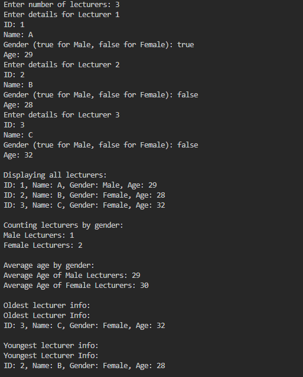

LABS REPORTS #3

1.2 Create, insert, and display Array of Object

First is Creating a class called "Rectangle", and put this below

public class Rectangle {
    public int length;
    public int width;
    
}

The second is Create new Public Class called "ArrayofObject"

public class ArrayofObject {
    public static void main(String[] args) {
        Rectangle[] rectanglesArray = new Rectangle[3];

        rectanglesArray[0] = new Rectangle();
        rectanglesArray[0].length = 110;
        rectanglesArray[0].width = 30;

        rectanglesArray[1] = new Rectangle();
        rectanglesArray[1].length = 80;
        rectanglesArray[1].width = 40;

        rectanglesArray[2] = new Rectangle();
        rectanglesArray[2].length = 100;
        rectanglesArray[2].width = 20;

        System.out.println("First rectangle width"+ rectanglesArray[0].width + ", length" + rectanglesArray[0].length);
        System.out.println("Second rectangle width"+ rectanglesArray[1].width + ", length" + rectanglesArray[1].length);
        System.out.println("Third rectangle width"+ rectanglesArray[2].width + ", length" + rectanglesArray[2].length);
    }
    
}

1.2.1 Result 

1.2.2 Questions

1. Based on part 1.2, does the class that are going to be used as an array of object must have
attributes and methods? Please explain!

2. Does class Rectangle have constructor? If not, why we instantiate the object as follows?

3. What’s the meaning of this line of code?

Rectangle[] rectangleArray = new Rectangle[3];

4. What’s the meaning of these lines of code?

 rectangleArray[1] = new Rectangle();
 rectangleArray[1].length = 80;
 rectangleArray[1].width = 40;

5. Why ArrayOfObject class and Rectangle class should be separated?

Answer : 

1. Not necessarily. A class can be used in an array even if it only has attributes, like Rectangle. Methods make it more useful by allowing actions on the objects.

2. No, it doesn’t have a constructor, but Java automatically provides a default constructor.

3. Rectangle[] rectangleArray = new Rectangle[3]; -> It creates an array that can hold three Rectangle objects

4. Creates a new Rectangle object at index 1 of the array.
Sets its length to 80 and width to 40.

5. It keeps things organized. Rectangle is just a blueprint, while ArrayOfObject handles the actual logic.

1.3 Input data into Array of Objects using Loops

import java.util.Scanner;

public class ArrayofObject {
    public static void main(String[] args) {
        Rectangle[] rectanglesArray = new Rectangle[3];
        Scanner sc = new Scanner (System.in);

        for (int i = 0; i < 3; i++) {
            rectanglesArray[i] = new Rectangle();
            System.out.println("Rectangle " + i);

            System.out.println("Input Length : ");
            rectanglesArray[i].length = sc.nextInt();
            
            System.out.println("Input Width : ");
            rectanglesArray[i].width = sc.nextInt();           
        }

        for (int i = 0; i < 3; i++) {
            System.out.println("Rectangle " + i);
            System.out.println("Width " + rectanglesArray[0].width + ", Length: " + rectanglesArray[0].length);
    }
 }
}

1.3.1 Result

1.3.2Questions

1. Does array of object can be implemented on 2D array?

2. If yes, then please give an example. Otherwise, please explain.

3. There is a Square class that has an attribute side with integer as its data type. There
will be an error when we run this code, why?
Square[] squareArray = new Square[100];
squareArray[5].side = 20;

4. Modify the code on part 1.3 so that the length of the array will be defined from user
input.

5. Can we duplicate the instantiation process in array of objects? For example, we assign
the object in ppArray[i] and ppArray[0], the instantiation process of ppArray[0] will be
done twice. What’s the effect of this?

Answer :

1. Yes, a 2D array of objects is possible. Instead of Rectangle[], we can use Rectangle[][] to store objects in a grid-like structure.

2. Rectangle[][] rectangleGrid = new Rectangle[2][3]; 

for (int i = 0; i < 2; i++) {
    for (int j = 0; j < 3; j++) {
        rectangleGrid[i][j] = new Rectangle();
        rectangleGrid[i][j].length = (i + 1) * 10;
        rectangleGrid[i][j].width = (j + 1) * 5;
    }
}

3. The error happens because squareArray[5] is null. The array is created, but individual Square objects are not instantiated.

4. Edited Version :

import java.util.Scanner;

public class ArrayofObject {
    public static void main(String[] args) {
        Scanner sc = new Scanner(System.in);

        System.out.print("Enter number of rectangles: ");
        int n = sc.nextInt();

        Rectangle[] rectanglesArray = new Rectangle[n];

        for (int i = 0; i < n; i++) {
            rectanglesArray[i] = new Rectangle();
            System.out.println("Rectangle " + i);

            System.out.print("Input Length: ");
            rectanglesArray[i].length = sc.nextInt();

            System.out.print("Input Width: ");
            rectanglesArray[i].width = sc.nextInt();
        }

        for (int i = 0; i < n; i++) {
            System.out.println("Rectangle " + i);
            System.out.println("Width: " + rectanglesArray[i].width + ", Length: " + rectanglesArray[i].length);
        }

        sc.close();
    }
}

5. If we assign a new object to an already assigned array element, the old object is lost 

1.4 Mathematical operation in array of object’s attribute

public class ArrayBlocks {
    public static void main(String[] args) {
        Blocks[] blArray = new Blocks[3];

        blArray[0] = new Blocks(100,30,12);
        blArray[1] = new Blocks(120,40,15);
        blArray[2] = new Blocks(210,50,25);

        for (int i = 0; i < 3; i++) {
            System.out.println("Volume Blocks - " + i + " : " + blArray[i].countVolume());
        }
    }
    
}

Blocks : 

public class Blocks {
    public int length;
    public int width;
    public int height;

    public Blocks(int length, int width, int height) {
        this.length = length;
        this.width = width;
        this.height = height;
    }

    public int countVolume() {
        return length * width * height;
    }

    public int countArea() {
        return 2 * ((length * width) + (width * height) + (length * height));
    }

    public int countPerimeter() {
        return 4 * (length + width + height);
    }
}

1.4.1 Result

1.4.2 Questions

1. Can we have more than one constructor in one class? Please explain.

2. Create a Triangle class as follows.
public class Triangle{
public int base;
 public int height;
}

Add another constructor in this class that has parameter int a, int t. These represents
its base and height.

3. Add method countArea() and countPerimeter() in class Triangle

4. In main function, instantiate array of Triangle objects. Assign the attributes values as
follows:

0th trArray base: 10, height: 4

1st trArray base: 20, height: 10

2nd trArray base: 15, height: 6

3rd trArray base: 25, height: 10

5. Display the result of area and perimeter for each triangle by calling the method
countArea() and countPerimeter()

Answer : 

1. Yes, a class can have multiple constructors. This is called constructor overloading, where different constructors allow object creation with different sets of parameters.

2. public class Blocks {
    public int length;
    public int width;
    public int height;

    // Constructor with parameters
    public Blocks(int length, int width, int height) {
        this.length = length;
        this.width = width;
        this.height = height;
    }

    // Method to calculate volume
    public int countVolume() {
        return length * width * height;
    }
}

3. public class Blocks {
    public int length;
    public int width;
    public int height;

    public Blocks(int length, int width, int height) {
        this.length = length;
        this.width = width;
        this.height = height;
    }

    public int countVolume() {
        return length * width * height;
    }

    public int countArea() {
        return 2 * ((length * width) + (width * height) + (length * height));
    }

    public int countPerimeter() {
        return 4 * (length + width + height);
    }
}

4. public class ArrayBlocks {
    public static void main(String[] args) {
        Blocks[] blArray = new Blocks[3];

        blArray[0] = new Blocks(100, 30, 12);
        blArray[1] = new Blocks(120, 40, 15);
        blArray[2] = new Blocks(210, 50, 25);

        for (int i = 0; i < blArray.length; i++) {
            System.out.println("Block " + i);
            System.out.println("Volume: " + blArray[i].countVolume());
            System.out.println("Surface Area: " + blArray[i].countArea());
            System.out.println("Perimeter: " + blArray[i].countPerimeter());
            System.out.println();
        }
    }
}

5. 

1.5 Assignments

Lecturer : 

public class Lecturer {
    private String id;
    private String name;
    private boolean gender;
    private int age;

    public Lecturer(String id, String name, boolean gender, int age) {
        this.id = id;
        this.name = name;
        this.gender = gender;
        this.age = age;
    }

    public String getId() {
        return id;
    }

    public String getName() {
        return name;
    }

    public boolean isMale() {
        return gender;
    }

    public int getAge() {
        return age;
    }

    public void displayInfo() {
        System.out.println("ID: " + id + ", Name: " + name + ", Gender: " + (gender ? "Male" : "Female") + ", Age: " + age);
    }
}

Lecturer Data : 

public class LecturerData01 {
    public static void showAllLecturerData(Lecturer[] lecturerArray) {
        for (Lecturer lecturer : lecturerArray) {
            lecturer.displayInfo();
        }
    }

    public static void countLecturerByGender(Lecturer[] lecturerArray) {
        int maleCount = 0, femaleCount = 0;
        for (Lecturer lecturer : lecturerArray) {
            if (lecturer.isMale()) {
                maleCount++;
            } else {
                femaleCount++;
            }
        }
        System.out.println("Male Lecturers: " + maleCount);
        System.out.println("Female Lecturers: " + femaleCount);
    }

    public static void averageLecturerAgeByGender(Lecturer[] lecturerArray) {
        int maleAgeSum = 0, femaleAgeSum = 0, maleCount = 0, femaleCount = 0;

        for (Lecturer lecturer : lecturerArray) {
            if (lecturer.isMale()) {
                maleAgeSum += lecturer.getAge();
                maleCount++;
            } else {
                femaleAgeSum += lecturer.getAge();
                femaleCount++;
            }
        }

        System.out.println("Average Age of Male Lecturers: " + (maleCount > 0 ? (maleAgeSum / maleCount) : "N/A"));
        System.out.println("Average Age of Female Lecturers: " + (femaleCount > 0 ? (femaleAgeSum / femaleCount) : "N/A"));
    }

    public static void showOldestLecturerInfo(Lecturer[] lecturerArray) {
        Lecturer oldest = lecturerArray[0];
        for (Lecturer lecturer : lecturerArray) {
            if (lecturer.getAge() > oldest.getAge()) {
                oldest = lecturer;
            }
        }
        System.out.println("Oldest Lecturer Info:");
        oldest.displayInfo();
    }

    public static void showYoungestLecturerInfo(Lecturer[] lecturerArray) {
        Lecturer youngest = lecturerArray[0];
        for (Lecturer lecturer : lecturerArray) {
            if (lecturer.getAge() < youngest.getAge()) {
                youngest = lecturer;
            }
        }
        System.out.println("Youngest Lecturer Info:");
        youngest.displayInfo();
    }
}

Lecturer Demo : 

import java.util.Scanner;

public class LecturerDemo01 {
    public static void main(String[] args) {
        Scanner scanner = new Scanner(System.in);

        System.out.print("Enter number of lecturers: ");
        int n = scanner.nextInt();
        scanner.nextLine();

        Lecturer[] lecturers = new Lecturer[n];

        for (int i = 0; i < n; i++) {
            System.out.println("Enter details for Lecturer " + (i + 1));
            System.out.print("ID: ");
            String id = scanner.nextLine();
            System.out.print("Name: ");
            String name = scanner.nextLine();
            System.out.print("Gender (true for Male, false for Female): ");
            boolean gender = scanner.nextBoolean();
            System.out.print("Age: ");
            int age = scanner.nextInt();
            scanner.nextLine();

            lecturers[i] = new Lecturer(id, name, gender, age);
        }

        System.out.println("\nDisplaying all lecturers:");
        LecturerData01.showAllLecturerData(lecturers);

        System.out.println("\nCounting lecturers by gender:");
        LecturerData01.countLecturerByGender(lecturers);

        System.out.println("\nAverage age by gender:");
        LecturerData01.averageLecturerAgeByGender(lecturers);

        System.out.println("\nOldest lecturer info:");
        LecturerData01.showOldestLecturerInfo(lecturers);

        System.out.println("\nYoungest lecturer info:");
        LecturerData01.showYoungestLecturerInfo(lecturers);

        scanner.close();
    }
}

Output :

