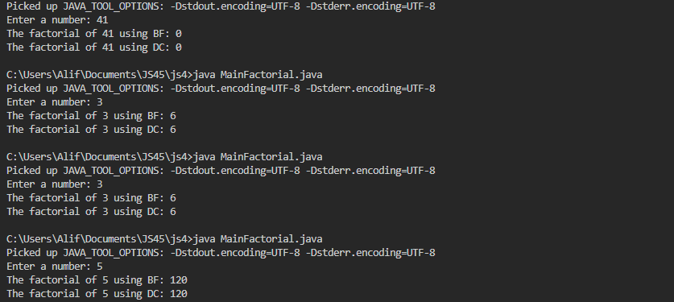
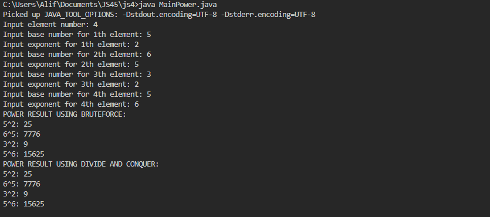
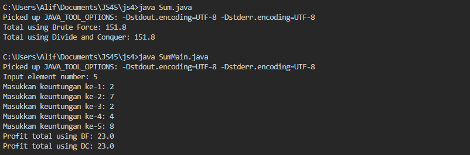
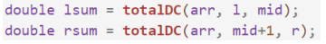
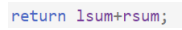

5.2.1. Experiment Steps 

Factorial : 

public class Factorial {

    int factorialBF;
    int factorialDC;

    int factorialBF(int n) {
        int facto = 1;
        for (int i = 1; i <= n; i++) {
            facto = facto * i;
        }
        return facto;
    }

    int factorialDC(int n) {
        if (n == 1) {
            return 1;
        } else {
            int facto = n * factorialDC(n - 1);
            return facto;
        }
    }
}

MainFactorial: 

import java.util.Scanner;

public class MainFactorial {

    public static void main(String[] args) {
        Scanner sc = new Scanner(System.in);
        System.out.print("Enter a number: ");
        int num = sc.nextInt();

        Factorial fk = new Factorial();
        System.out.println("The factorial of " + num + " using BF: " + fk.factorialBF(num));
        System.out.println("The factorial of " + num + " using DC: " + fk.factorialDC(num));
    }
}

5.2.2. Verification of Experiment Results 

5.2.3. Questions

1. In the base case of the Divide and Conquer algorithm for calculating factorial, explain the 

differences in the code structure between the if and else conditions! 

2. Is it possible to modify the loop in the factorialBF() method to use an alternative to the for 

loop? Please explain and give example if needed! 

3. Please explain the differences between facto = facto*i; and int facto = n * 
factorialDC(n-1); ! 

4. Make a conclusion about the differences in how each method works. factorialBF()  and 
factorialDC()! 

Answer :

1. The if condition (if (n == 1) return 1;) is the stopping point—it prevents infinite recursion. The else part keeps calling the function with n-1, multiplying each step until it reaches 1. Without this base case, the function would keep calling itself forever.

2. Instead of for loop, a while loop can do the same job. It just updates the factorial step by step until it reaches n.

3. In the factorialBF() method, facto = facto * i; just keeps multiplying numbers one by one in a loop. In factorialDC(), int facto = n * factorialDC(n - 1); is doing the same thing, but through recursion—it keeps calling itself with a smaller n until it gets to 1. 

4. The factorialBF() is simple and memory-efficient because it just uses a loop., while factorialDC() uses recursion, which means it takes up more memory and could crash if n is too big.

5.3.1. Experiment Steps 

Power : 

public class Power {

    int baseNumber, exponent;

    Power(int n, int e) {
        baseNumber = n;
        exponent = e;

    }

    int powerBF(int n, int e) {
        int result = 1;
        for (int i = 0; i < e; i++) {
            result = result * n;
        }
        return result;
    }

    int powerDC(int n, int e) {
        if (e == 1) {
            return n;
        } else {
            if (e % 2 == 1) {
                return (powerDC(n, e / 2) * powerDC(n, e / 2) * n);
            } else {
                return (powerDC(n, e / 2) * powerDC(n, e / 2));
            }
        }
    }

}

MainPower:

import java.util.Scanner;

public class MainPower {

    public static void main(String[] args) {
        Scanner input = new Scanner(System.in);

        System.out.print("Input element number: ");
        int element = input.nextInt();

        Power[] png = new Power[element];

        for (int i = 0; i < element; i++) {
            System.out.print("Input base number for " + (i + 1) + "th element: ");
            int base = input.nextInt();
            System.out.print("Input exponent for " + (i + 1) + "th element: ");
            int exp = input.nextInt();

            png[i] = new Power(base, exp);
        }

        System.out.println("POWER RESULT USING BRUTEFORCE:");
        for (Power p : png) {
            System.out.println(p.baseNumber + "^" + p.exponent + ": " + p.powerBF(p.baseNumber, p.exponent));
        }

        System.out.println("POWER RESULT USING DIVIDE AND CONQUER:");
        for (Power p : png) {
            System.out.println(p.baseNumber + "^" + p.exponent + ": " + p.powerDC(p.baseNumber, p.exponent));
        }

        input.close();
    }
}

5.3.2. Verification of Experiment Results 

5.3.3. Questions 

1. Explain the differences between the two methods created powerBF() dan powerDC()!

2. Does the combine stage exist in the provided code? Show the relevant part!

3. In the powerBF() method, parameters are used to pass the base number and its exponent, even
though the Power class already contains attributes for these values (baseNumber and exponent
atribute). Do you think it is still relevant for the method to have parameters? Could the method
be implemented without parameters instead? If so, how would the powerBF() method be
structured without parameters?

4. Summarize how the powerBF() and powerDC() methods work!

Answer : 

1. 
powerBF(): Uses a loop (O(e)), slower for large exponents.

powerDC(): Uses recursion (O(log e)), more efficient by dividing the problem.

2. return (powerDC(n, e / 2) * powerDC(n, e / 2) * (e % 2 == 1 ? n : 1));

3. No, since baseNumber and exponent exist in the class.

4. 
powerBF(): Iterative, slower for large exponents.

powerDC(): Recursive, faster by reducing calculations.

5.4.1. Experiment Steps

Sum : 

public class Sum {

    double[] profits;

    public Sum(int el) {
        profits = new double[el];
    }

    public void setProfits(double[] values) {
        if (values.length == profits.length) {
            System.arraycopy(values, 0, profits, 0, values.length);
        }
    }

    public double totalBF() {
        double total = 0;
        for (int i = 0; i < profits.length; i++) {
            total += profits[i];
        }
        return total;
    }

    public double totalDC(double[] arr, int l, int r) {
        if (l == r) {
            return arr[l];
        }
        int mid = (l + r) / 2;
        double lsum = totalDC(arr, l, mid);
        double rsum = totalDC(arr, mid + 1, r);
        return lsum + rsum;
    }

    public double totalDC() {
        return totalDC(profits, 0, profits.length - 1);
    }

    public static void main(String[] args) {
        Sum sumObj = new Sum(5);
        double[] values = {10.5, 20.3, 30.7, 40.2, 50.1};
        sumObj.setProfits(values);

        System.out.println("Total using Brute Force: " + sumObj.totalBF());
        System.out.println("Total using Divide and Conquer: " + sumObj.totalDC());
    }

}

SumMain:

import java.util.Scanner;

public class SumMain {

    public static void main(String[] args) {
        Scanner input = new Scanner(System.in);

        System.out.print("Input element number: ");
        int element = input.nextInt();

        Sum sm = new Sum(element);

        for (int i = 0; i < element; i++) {
            System.out.print("Masukkan keuntungan ke-" + (i + 1) + ": ");
            sm.profits[i] = input.nextDouble();
        }

        System.out.println("Profit total using BF: " + sm.totalBF());
        System.out.println("Profit total using DC: " + sm.totalDC());

        input.close();
    }
}

5.4.2. Verification of Experiment Results

5.4.3. Questions

1. Why is mid variable needed in totalDC()method?

2. Explain the following statements in totalDC()method?

3. Why is it necessary to sum the results of lsum and rsum as shown below??

4. What is the base case of totalDC()method?

5. Draw a conclusion about how totalDC() works!

Answer :

1. It splits the array into two halves, allowing the Divide and Conquer approach to break the problem into smaller parts.

2. 
double lsum = totalDC(arr, l, mid);

double rsum = totalDC(arr, mid + 1, r);

These recursively calculate the sum of the left (lsum) and right (rsum) halves of the array.

3. Why sum lsum and rsum?
The total sum is obtained by combining the left and right halves after recursion completes.

4. 
if (l == r) return arr[l];

When only one element remains, it is returned as is.

5. totalDC() recursively divides the array, computes sums, and merges results. It is efficient for handling large datasets compared to brute force.

5.5. Assignments

Students Scores :

public class StudentScores {

    int[] midtermScores;
    int[] finalScores;

    public StudentScores(int[] midtermScores, int[] finalScores) {
        this.midtermScores = midtermScores;
        this.finalScores = finalScores;
    }

    public int findMaxUTS(int l, int r) {
        if (l == r) {
            return midtermScores[l];
        }
        int mid = (l + r) / 2;
        int leftMax = findMaxUTS(l, mid);
        int rightMax = findMaxUTS(mid + 1, r);
        return Math.max(leftMax, rightMax);
    }

    public int findMinUTS(int l, int r) {
        if (l == r) {
            return midtermScores[l];
        }
        int mid = (l + r) / 2;
        int leftMin = findMinUTS(l, mid);
        int rightMin = findMinUTS(mid + 1, r);
        return Math.min(leftMin, rightMin);
    }

    public double calculateAverageUAS() {
        double total = 0;
        for (int score : finalScores) {
            total += score;
        }
        return total / finalScores.length;
    }
}

Students Scores Main : 

public class StudentScoresMain {

    public static void main(String[] args) {
        int[] midtermScores = {78, 85, 90, 76, 92, 88, 80, 82};
        int[] finalScores = {82, 88, 87, 79, 95, 85, 83, 84};

        StudentScores studentScores = new StudentScores(midtermScores, finalScores);

        System.out.println("Highest Midterm Score (UTS): " + studentScores.findMaxUTS(0, midtermScores.length - 1));
        System.out.println("Lowest Midterm Score (UTS): " + studentScores.findMinUTS(0, midtermScores.length - 1));
        System.out.println("Average Final Score (UAS): " + studentScores.calculateAverageUAS());
    }
}

a) Find the highest Midterm Score (UTS) using the Divide and Conquer approach.

b) Find the lowest Midterm Score (UTS) using the Divide and Conquer approach.

c) Calculate the average Final Score (UAS) of all students using the Brute Force approach.

Answer : 

