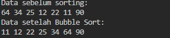
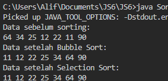
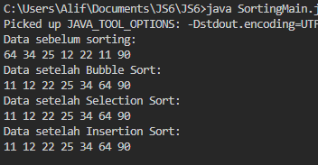
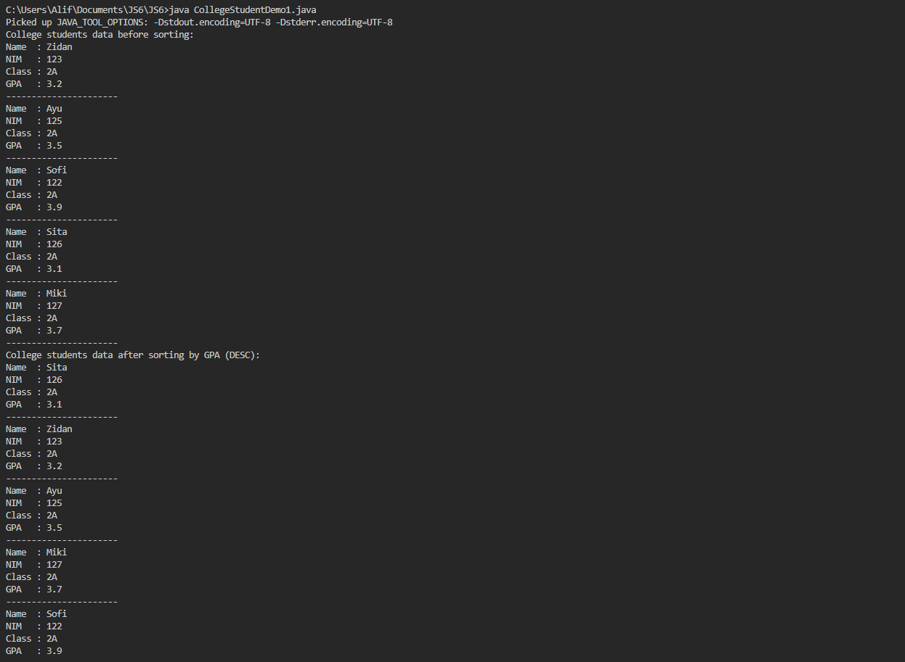
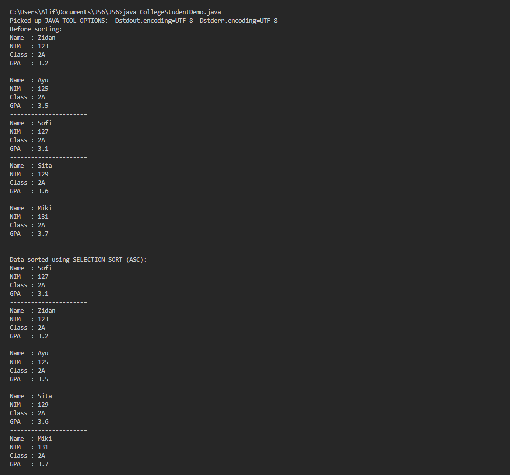
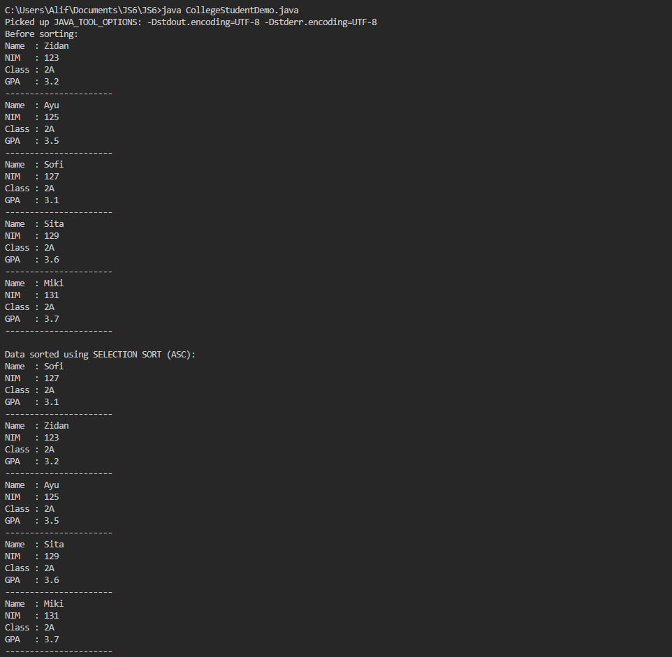
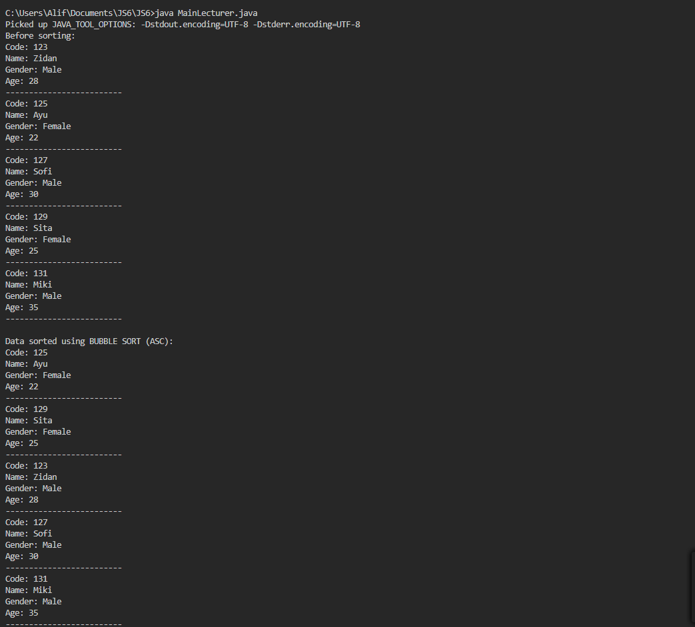
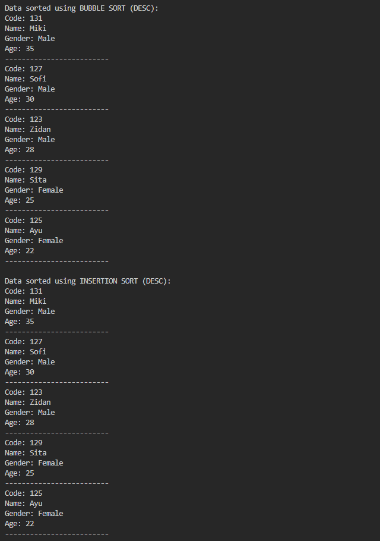

5.2.1

public class Sorting {

    int[] data;
    int jmlDat;

    Sorting(int[] data) {
        this.data = data.clone();
        this.jmlDat = data.length;
    }

    void bubbleSort() {
        for (int i = 0; i < jmlDat - 1; i++) {
            boolean swapped = false;
            for (int j = 0; j < jmlDat - 1 - i; j++) {
                if (data[j] > data[j + 1]) {
                    int temp = data[j];
                    data[j] = data[j + 1];
                    data[j + 1] = temp;
                    swapped = true;
                }
            }
            if (!swapped) {
                break;
            }
        }
    }

    void tampil() {
        for (int i = 0; i < jmlDat; i++) {
            System.out.print(data[i] + " ");
        }
        System.out.println();
    }
}

5.2.2

public class Sorting {

    int[] data;
    int jmlDat;

    Sorting(int[] data) {
        this.data = data.clone();
        this.jmlDat = data.length;
    }

    void bubbleSort() {
        for (int i = 0; i < jmlDat - 1; i++) {
            boolean swapped = false;
            for (int j = 0; j < jmlDat - 1 - i; j++) {
                if (data[j] > data[j + 1]) {
                    int temp = data[j];
                    data[j] = data[j + 1];
                    data[j + 1] = temp;
                    swapped = true;
                }
            }
            if (!swapped) {
                break;
            }
        }
    }

    void selectionSort() {
        for (int i = 0; i < jmlDat - 1; i++) {
            int minIdx = i;
            for (int j = i + 1; j < jmlDat; j++) {
                if (data[j] < data[minIdx]) {
                    minIdx = j;
                }
            }
            int temp = data[minIdx];
            data[minIdx] = data[i];
            data[i] = temp;
        }
    }

    void tampil() {
        for (int i = 0; i < jmlDat; i++) {
            System.out.print(data[i] + " ");
        }
        System.out.println();
    }
}

5.2.3

public class Sorting {

    int[] data;
    int jmlDat;

    Sorting(int[] data) {
        this.data = data.clone();
        this.jmlDat = data.length;
    }

    void bubbleSort() {
        for (int i = 0; i < jmlDat - 1; i++) {
            boolean swapped = false;
            for (int j = 0; j < jmlDat - 1 - i; j++) {
                if (data[j] > data[j + 1]) {
                    int temp = data[j];
                    data[j] = data[j + 1];
                    data[j + 1] = temp;
                    swapped = true;
                }
            }
            if (!swapped) {
                break;
            }
        }
    }

    void selectionSort() {
        for (int i = 0; i < jmlDat - 1; i++) {
            int minIdx = i;
            for (int j = i + 1; j < jmlDat; j++) {
                if (data[j] < data[minIdx]) {
                    minIdx = j;
                }
            }
            int temp = data[minIdx];
            data[minIdx] = data[i];
            data[i] = temp;
        }
    }

    void insertionSort() {
        for (int i = 1; i < jmlDat; i++) {
            int key = data[i];
            int j = i - 1;
            while (j >= 0 && data[j] > key) {
                data[j + 1] = data[j];
                j--;
            }
            data[j + 1] = key;
        }
    }

    void tampil() {
        for (int i = 0; i < jmlDat; i++) {
            System.out.print(data[i] + " ");
        }
        System.out.println();
    }
}

5.2.4

5.2.5

1. Explain the function of the following code program:

if (data[j-1] > data[j]) {
    temp = data[j];
    data[j] = data[j-1];
    data[j-1] = temp;
}

2. Show the code program that is the algorithm for finding the minimum value in selection sort!

3. In Insertion sort, explain the meaning of the condition in the loop

while (j >= 0 && data[j] > temp)

4. In Insertion sort, what is the purpose of the command data[j+1] = data[j];

Answer : 

1. It is responsible for swapping two elements in an array if the previous element is greater than the current element.

2. The Selection Sort algorithm finds the minimum value in the unsorted part of the array and swaps it with the current position.

3.     void selectionSort() {
        for (int i = 0; i < jmlDat - 1; i++) {
            int minIdx = i;
            for (int j = i + 1; j < jmlDat; j++) {
                if (data[j] < data[minIdx]) {
                    minIdx = j;
                }
            }
            int temp = data[minIdx];
            data[minIdx] = data[i];
            data[i] = temp;
        }
    }

4. When a larger element is found, it is moved one position to the right (data[j+1] = data[j]). This shifting continues until an appropriate position is found for temp, ensuring that the array remains sorted.

5.3.1

public class CollegeStudent1 {

    String nim;
    String name;
    String className;
    double gpa;

    CollegeStudent1() {
    }

    CollegeStudent1(String nim, String name, String className, double gpa) {
        this.nim = nim;
        this.name = name;
        this.className = className;
        this.gpa = gpa;
    }

    void displayInfo() {
        System.out.println("Name  : " + name);
        System.out.println("NIM   : " + nim);
        System.out.println("Class : " + className);
        System.out.println("GPA   : " + gpa);
    }
}

5.3.2

public class CollegeStudentAchievements {

    CollegeStudent1[] listStudents = new CollegeStudent1[5];
    int idx = 0;

    void add(CollegeStudent1 s) {
        if (idx < listStudents.length) {
            listStudents[idx] = s;
            idx++;
        } else {
            System.out.println("Data is full");
        }
    }

    void display() {
        for (int i = 0; i < idx; i++) {
            listStudents[i].displayInfo();
            System.out.println("----------------------");
        }
    }

    void bubbleSort() {
        for (int i = 0; i < idx - 1; i++) {
            for (int j = 0; j < idx - 1 - i; j++) {
                if (listStudents[j].gpa > listStudents[j + 1].gpa) {
                    CollegeStudent1 temp = listStudents[j];
                    listStudents[j] = listStudents[j + 1];
                    listStudents[j + 1] = temp;
                }
            }
        }
    }
}

public class CollegeStudentDemo1 {

    public static void main(String[] args) {
        CollegeStudentAchievements list = new CollegeStudentAchievements();

        CollegeStudent1 s1 = new CollegeStudent1("123", "Zidan", "2A", 3.2);
        CollegeStudent1 s2 = new CollegeStudent1("125", "Ayu", "2A", 3.5);
        CollegeStudent1 s3 = new CollegeStudent1("122", "Sofi", "2A", 3.9);
        CollegeStudent1 s4 = new CollegeStudent1("126", "Sita", "2A", 3.1);
        CollegeStudent1 s5 = new CollegeStudent1("127", "Miki", "2A", 3.7);

        list.add(s1);
        list.add(s2);
        list.add(s3);
        list.add(s4);
        list.add(s5);

        System.out.println("College students data before sorting:");
        list.display();

        System.out.println("College students data after sorting by GPA (DESC):");
        list.bubbleSort();
        list.display();
    }
}

5.3.3

5.3.4
1. 

a. Why is the condition of the i loop i<listMhs.length-1?

b. Why is the condition of the j loop j<listMhs.length-i?

c. If the number of data in listMhs is 50, then how many times will the i loop be executed? And how many stages of bubble sort will be taken?

2. Modify the program above where the student data is dynamic (input from the keyboard) consisting of nim, name, class, and ipk!

Answer : 

1.  Understanding the Loop Conditions in bubbleSort()
(a) The outer loop runs n-1 times because each pass places the largest remaining element in the correct position.
(b) The inner loop runs fewer times in each pass since the last i elements are already sorted.
(c) If there are 50 students, the sorting process will take 49 passes and a lot of comparisons.

2. 

import java.util.Scanner;

public class CollegeStudentDemo {

    public static void main(String[] args) {
        Scanner sc = new Scanner(System.in);
        CollegeStudentAchievements list = new CollegeStudentAchievements();

        System.out.print("Number of students: ");
        int n = sc.nextInt();
        sc.nextLine();

        for (int i = 0; i < n; i++) {
            System.out.print("NIM: ");
            String nim = sc.nextLine();
            System.out.print("Name: ");
            String name = sc.nextLine();
            System.out.print("Class: ");
            String kelas = sc.nextLine();
            System.out.print("GPA: ");
            double gpa = sc.nextDouble();
            sc.nextLine();

            list.add(new CollegeStudent1(nim, name, kelas, gpa));
        }

        System.out.println("\nBefore sorting:");
        list.display();

        System.out.println("\nAfter sorting by GPA:");
        list.bubbleSort();
        list.display();

        sc.close();
    }
}

5.3.5

public class CollegeStudentAchievements {

    CollegeStudent1[] listStudents = new CollegeStudent1[5];
    int idx;

    void add(CollegeStudent1 s) {
        if (idx < listStudents.length) {
            listStudents[idx] = s;
            idx++;
        } else {
            System.out.println("Data is full");
        }
    }

    void display() {
        for (CollegeStudent1 s : listStudents) {
            s.displayInfo();
            System.out.println("----------------------");
        }
    }

    void bubbleSort() {
        for (int i = 0; i < listStudents.length - 1; i++) {
            for (int j = 0; j < listStudents.length - 1 - i; j++) {
                if (listStudents[j].gpa > listStudents[j + 1].gpa) {
                    CollegeStudent1 temp = listStudents[j];
                    listStudents[j] = listStudents[j + 1];
                    listStudents[j + 1] = temp;
                }
            }
        }
    }

    void selectionSort() {
        for (int i = 0; i < listStudents.length - 1; i++) {
            int minIndex = i;
            for (int j = i + 1; j < listStudents.length; j++) {
                if (listStudents[j].gpa < listStudents[minIndex].gpa) {
                    minIndex = j;
                }
            }
            CollegeStudent1 temp = listStudents[minIndex];
            listStudents[minIndex] = listStudents[i];
            listStudents[i] = temp;
        }
    }
}

public class CollegeStudentDemo {

    public static void main(String[] args) {
        CollegeStudentAchievements list = new CollegeStudentAchievements();

        list.add(new CollegeStudent1("123", "Zidan", "2A", 3.2));
        list.add(new CollegeStudent1("125", "Ayu", "2A", 3.5));
        list.add(new CollegeStudent1("127", "Sofi", "2A", 3.1));
        list.add(new CollegeStudent1("129", "Sita", "2A", 3.6));
        list.add(new CollegeStudent1("131", "Miki", "2A", 3.7));

        System.out.println("Before sorting:");
        list.display();

        System.out.println("\nData sorted using SELECTION SORT (ASC):");
        list.selectionSort();
        list.display();
    }
}

5.3.6

5.3.7
In the selection sort method, the following lines of code appear:

int idxMin = i;
for (int j = i + 1; j < listMhs.length; j++) {
    if (listMhs[j].ipk < listMhs[idxMin].ipk) {
        idxMin = j;
    }
}

Answer : 

In the Selection Sort algorithm to find the smallest GPA (IPK) value in the unsorted portion of the array. The variable idxMin is initially set to i, assuming that the current element is the smallest. The loop iterates through the remaining elements in the array, comparing each GPA with the one stored at idxMin, idxMin holds the position of the smallest GPA in the unsorted section.

5.4.1

public class CollegeStudent1 {

    String nim;
    String name;
    String className;
    double gpa;

    CollegeStudent1() {
    }

    CollegeStudent1(String nim, String name, String className, double gpa) {
        this.nim = nim;
        this.name = name;
        this.className = className;
        this.gpa = gpa;
    }

    void displayInfo() {
        System.out.println("Name  : " + name);
        System.out.println("NIM   : " + nim);
        System.out.println("Class : " + className);
        System.out.println("GPA   : " + gpa);
    }
}

public class CollegeStudentAchievements {

    CollegeStudent1[] listStudents = new CollegeStudent1[5];
    int idx;

    void add(CollegeStudent1 s) {
        if (idx < listStudents.length) {
            listStudents[idx] = s;
            idx++;
        } else {
            System.out.println("Data is full");
        }
    }

    void display() {
        for (CollegeStudent1 s : listStudents) {
            s.displayInfo();
            System.out.println("----------------------");
        }
    }

    void bubbleSort() {
        for (int i = 0; i < listStudents.length - 1; i++) {
            for (int j = 0; j < listStudents.length - 1 - i; j++) {
                if (listStudents[j].gpa > listStudents[j + 1].gpa) {
                    CollegeStudent1 temp = listStudents[j];
                    listStudents[j] = listStudents[j + 1];
                    listStudents[j + 1] = temp;
                }
            }
        }
    }

    void selectionSort() {
        for (int i = 0; i < listStudents.length - 1; i++) {
            int minIndex = i;
            for (int j = i + 1; j < listStudents.length; j++) {
                if (listStudents[j].gpa < listStudents[minIndex].gpa) {
                    minIndex = j;
                }
            }
            CollegeStudent1 temp = listStudents[minIndex];
            listStudents[minIndex] = listStudents[i];
            listStudents[i] = temp;
        }
    }
}

public class CollegeStudentDemo {

    public static void main(String[] args) {
        CollegeStudentAchievements list = new CollegeStudentAchievements();

        list.add(new CollegeStudent1("123", "Zidan", "2A", 3.2));
        list.add(new CollegeStudent1("125", "Ayu", "2A", 3.5));
        list.add(new CollegeStudent1("127", "Sofi", "2A", 3.1));
        list.add(new CollegeStudent1("129", "Sita", "2A", 3.6));
        list.add(new CollegeStudent1("131", "Miki", "2A", 3.7));

        System.out.println("Before sorting:");
        list.display();

        System.out.println("\nData sorted using SELECTION SORT (ASC):");
        list.selectionSort();
        list.display();
    }
}

5.4.2

5.4.3

To modify insertionSort() for descending order, update the condition inside the while loop, replace in CollegeStudentAchievements:

while (j > 0 && listStudents[j - 1].gpa > temp.gpa)  

while (j > 0 && listStudents[j - 1].gpa < temp.gpa)  

void insertionSortDescending() {
    for (int i = 1; i < listStudents.length; i++) {
        CollegeStudent1 temp = listStudents[i];
        int j = i;
        while (j > 0 && listStudents[j - 1].gpa < temp.gpa) {
            listStudents[j] = listStudents[j - 1];
            j--;
        }
        listStudents[j] = temp;
    }
}

5.5

public class Lecturer1 {

    String code;
    String name;
    boolean gender;
    int age;

    public Lecturer1(String code, String name, boolean gender, int age) {
        this.code = code;
        this.name = name;
        this.gender = gender;
        this.age = age;
    }

    public void display() {
        System.out.println("Code: " + code);
        System.out.println("Name: " + name);
        System.out.println("Gender: " + (gender ? "Male" : "Female"));
        System.out.println("Age: " + age);
        System.out.println("-------------------------");
    }
}

public class LecturerData {

    Lecturer1[] lecturerData = new Lecturer1[10];
    int index = 0;

    public void add(Lecturer1 lecturer) {
        if (index < lecturerData.length) {
            lecturerData[index] = lecturer;
            index++;
        } else {
            System.out.println("Data is full!");
        }
    }

    public void display() {
        for (int i = 0; i < index; i++) {
            lecturerData[i].display();
        }
    }

    public void sortAscending() {
        for (int i = 0; i < index - 1; i++) {
            for (int j = 0; j < index - 1 - i; j++) {
                if (lecturerData[j].age > lecturerData[j + 1].age) {
                    Lecturer1 temp = lecturerData[j];
                    lecturerData[j] = lecturerData[j + 1];
                    lecturerData[j + 1] = temp;
                }
            }
        }
    }

    public void sortDescending() {
        for (int i = 0; i < index - 1; i++) {
            int maxIndex = i;
            for (int j = i + 1; j < index; j++) {
                if (lecturerData[j].age > lecturerData[maxIndex].age) {
                    maxIndex = j;
                }
            }
            Lecturer1 temp = lecturerData[maxIndex];
            lecturerData[maxIndex] = lecturerData[i];
            lecturerData[i] = temp;
        }
    }

    public void insertionSortDescending() {
        for (int i = 1; i < index; i++) {
            Lecturer1 temp = lecturerData[i];
            int j = i - 1;
            while (j >= 0 && lecturerData[j].age < temp.age) {
                lecturerData[j + 1] = lecturerData[j];
                j--;
            }
            lecturerData[j + 1] = temp;
        }
    }
}

public class MainLecturer {

    Lecturer1[] data = new Lecturer1[10];
    int idx = 0;

    public void add(Lecturer1 lecturer) {
        if (idx < data.length) {
            data[idx] = lecturer;
            idx++;
        } else {
            System.out.println("Data is full!");
        }
    }

    public void display() {
        if (idx == 0) {
            System.out.println("No data available.");
            return;
        }
        for (int i = 0; i < idx; i++) {
            data[i].display();
        }
    }

    public void bubbleSortAscending() {
        for (int i = 0; i < idx - 1; i++) {
            for (int j = 0; j < idx - 1 - i; j++) {
                if (data[j].age > data[j + 1].age) {
                    Lecturer1 temp = data[j];
                    data[j] = data[j + 1];
                    data[j + 1] = temp;
                }
            }
        }
    }

    public void bubbleSortDescending() {
        for (int i = 0; i < idx - 1; i++) {
            for (int j = 0; j < idx - 1 - i; j++) {
                if (data[j].age < data[j + 1].age) {
                    Lecturer1 temp = data[j];
                    data[j] = data[j + 1];
                    data[j + 1] = temp;
                }
            }
        }
    }

    public void insertionSortDescending() {
        for (int i = 1; i < idx; i++) {
            Lecturer1 temp = data[i];
            int j = i - 1;
            while (j >= 0 && data[j].age < temp.age) {
                data[j + 1] = data[j];
                j--;
            }
            data[j + 1] = temp;
        }
    }

    public static void main(String[] args) {
        MainLecturer main = new MainLecturer();
        main.add(new Lecturer1("123", "Zidan", true, 28));
        main.add(new Lecturer1("125", "Ayu", false, 22));
        main.add(new Lecturer1("127", "Sofi", true, 30));
        main.add(new Lecturer1("129", "Sita", false, 25));
        main.add(new Lecturer1("131", "Miki", true, 35));

        System.out.println("Before sorting:");
        main.display();

        System.out.println("\nData sorted using BUBBLE SORT (ASC):");
        main.bubbleSortAscending();
        main.display();

        System.out.println("\nData sorted using BUBBLE SORT (DESC):");
        main.bubbleSortDescending();
        main.display();

        System.out.println("\nData sorted using INSERTION SORT (DESC):");
        main.insertionSortDescending();
        main.display();
    }
}

