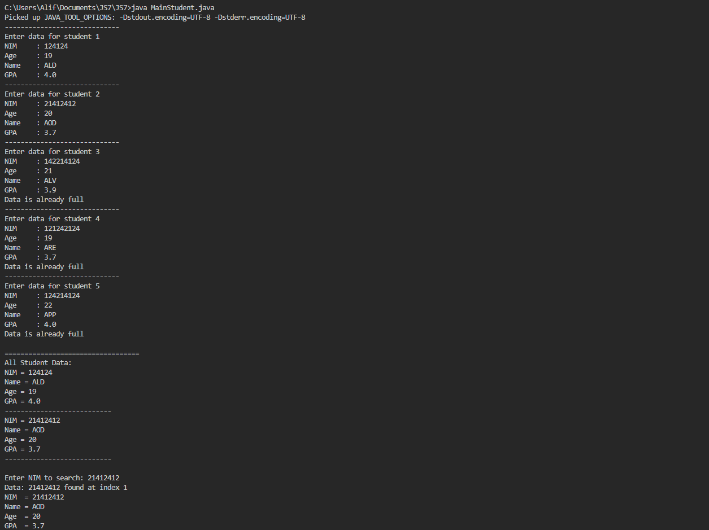
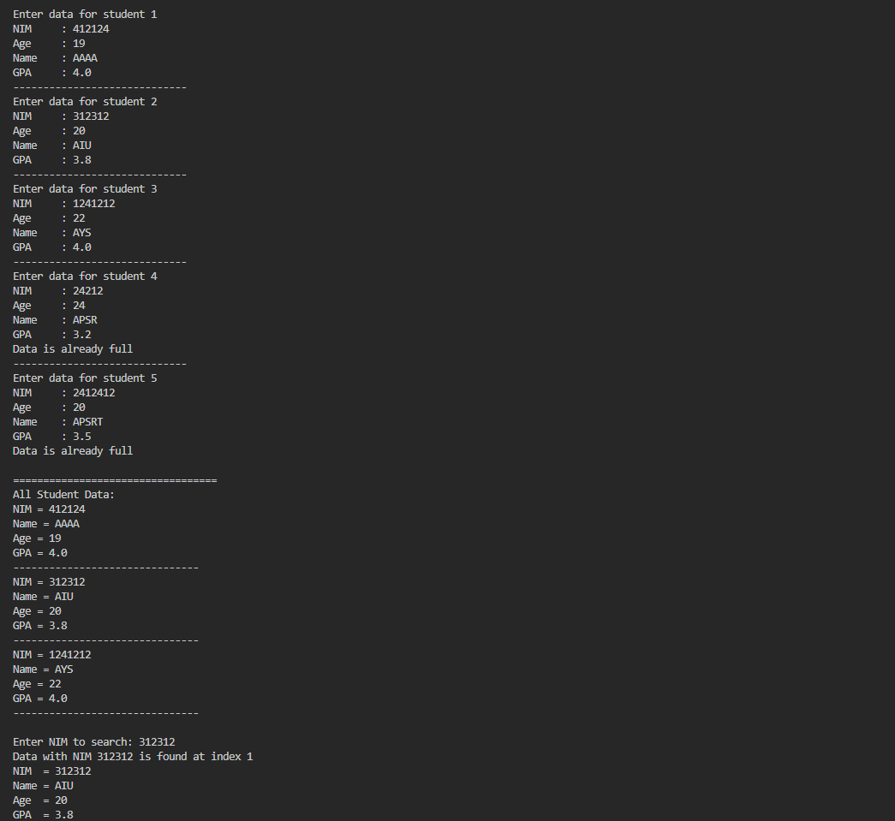
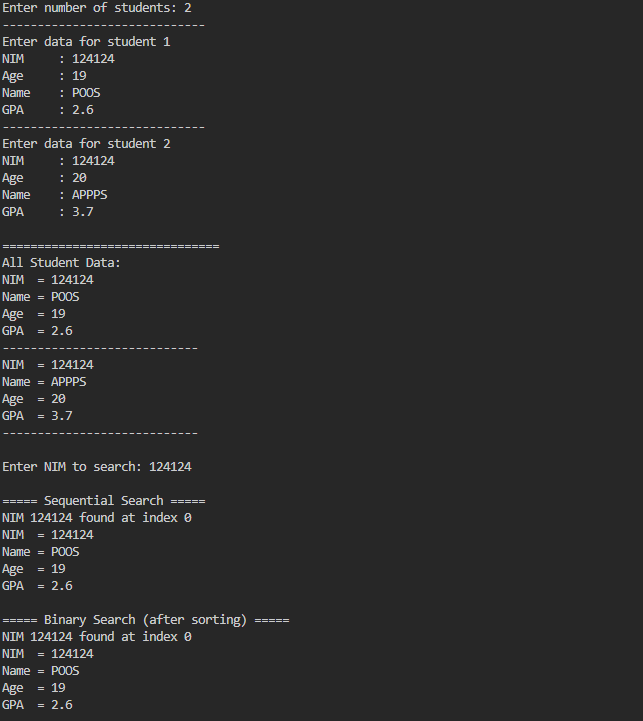
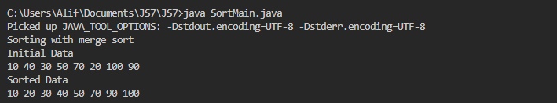
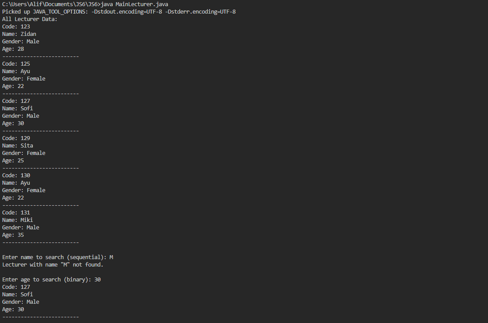
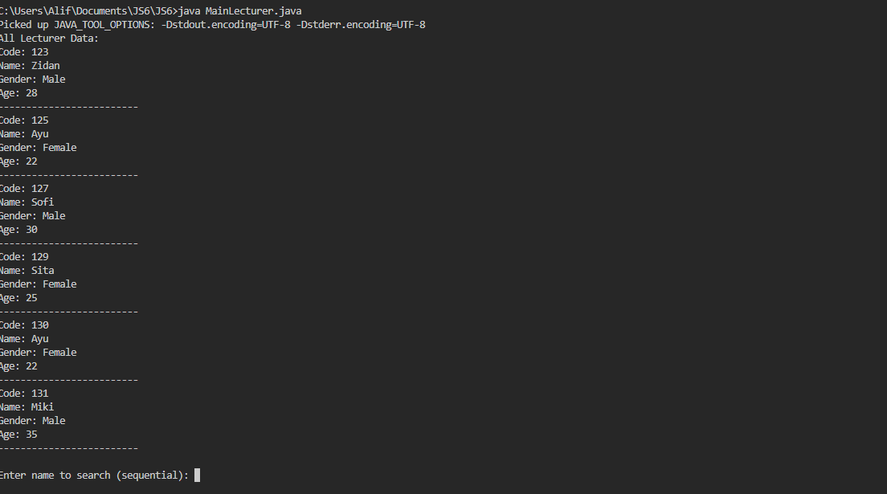
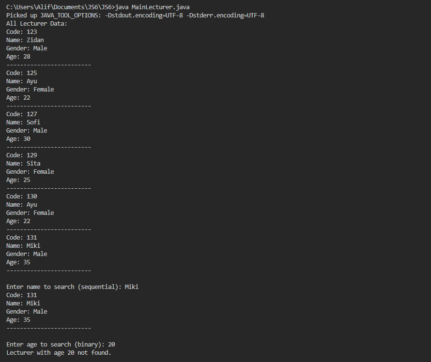

7.1 Steps

Students : 

public class Students {

    int nim, age;
    String name;
    double gpa;

    public Students(int nim, int age, String name, double gpa) {
        this.nim = nim;
        this.age = age;
        this.name = name;
        this.gpa = gpa;
    }

    public void display() {
        System.out.println("NIM = " + nim);
        System.out.println("Name = " + name);
        System.out.println("Age = " + age);
        System.out.println("GPA = " + gpa);
    }
}

SearchStudent:

public class SearchStudent {

    Students[] listStd = new Students[2];
    int idx;

    public void add(Students std) {
        if (idx < listStd.length) {
            listStd[idx] = std;
            idx++;
        } else {
            System.out.println("Data is already full");
        }
    }

    public void display() {
        for (Students students : listStd) {
            students.display();
            System.out.println("---------------------------");
        }
    }

    public int findSeqSearch(int search) {
        int position = -1;
        for (int i = 0; i < listStd.length; i++) {
            if (listStd[i].nim == search) {
                position = i;
                break;
            }
        }
        return position;
    }

    public void showPosition(int x, int pos) {
        if (pos != -1) {
            System.out.println("Data: " + x + " found at index " + pos);
        } else {
            System.out.println("Data: " + x + " not found");
        }
    }

    public void showData(int x, int pos) {
        if (pos != -1) {
            System.out.println("NIM  = " + listStd[pos].nim);
            System.out.println("Name = " + listStd[pos].name);
            System.out.println("Age  = " + listStd[pos].age);
            System.out.println("GPA  = " + listStd[pos].gpa);
        } else {
            System.out.println("Data " + x + " not found");
        }
    }
}

MainStudents:

import java.util.Scanner;

public class MainStudent {

    public static void main(String[] args) {
        Scanner sc = new Scanner(System.in);
        SearchStudent data = new SearchStudent();

        int amountStudents = 5;

        for (int i = 0; i < amountStudents; i++) {
            System.out.println("-----------------------------");
            System.out.println("Enter data for student " + (i + 1));

            System.out.print("NIM     : ");
            int nim = sc.nextInt();
            System.out.print("Age     : ");
            int age = sc.nextInt();
            sc.nextLine();
            System.out.print("Name    : ");
            String name = sc.nextLine();
            System.out.print("GPA     : ");
            double gpa = sc.nextDouble();

            Students s = new Students(nim, age, name, gpa);
            data.add(s);
        }

        System.out.println();
        System.out.println("==================================");
        System.out.println("All Student Data:");
        data.display();

        System.out.println();
        System.out.print("Enter NIM to search: ");
        int search = sc.nextInt();

        int position = data.findSeqSearch(search);
        data.showPosition(search, position);
        data.showData(search, position);
    }
}

7.2 Result

7.3 Questions

1. What’s the difference between displayData and displayPosition?

Answer : displayData shows all student info. displayPosition just tells you where the student was found.

2. What does break do in the code?

Answer : It stops the loop once the student is found, so it doesn’t keep checking.

3. Does it matter if NIMs aren’t sorted?

Answer : No error will happen. The result is still correct because sequential search checks one by one, not based on order.

4. Why is position set to -1, not 0?

Answer : -1 means “not found.” If we used 0, it could wrongly say the data was at index 0.

7.3.1 Steps :

SearchStudents:

public class SearchStudent {

    Students[] listStd = new Students[3];
    int idx;

    public void add(Students std) {
        if (idx < listStd.length) {
            listStd[idx] = std;
            idx++;
        } else {
            System.out.println("Data is already full");
        }
    }

    public void display() {
        for (Students students : listStd) {
            students.display();
            System.out.println("-------------------------------");
        }
    }

    public int findSeqSearch(int search) {
        int position = -1;
        for (int i = 0; i < listStd.length; i++) {
            if (listStd[i].nim == search) {
                position = i;
                break;
            }
        }
        return position;
    }

    public void showPosition(int x, int pos) {
        if (pos != -1) {
            System.out.println("Data with NIM " + x + " is found at index " + pos);
        } else {
            System.out.println("Data with NIM " + x + " is not found.");
        }
    }

    public void showData(int x, int pos) {
        if (pos != -1) {
            System.out.println("NIM  = " + listStd[pos].nim);
            System.out.println("Name = " + listStd[pos].name);
            System.out.println("Age  = " + listStd[pos].age);
            System.out.println("GPA  = " + listStd[pos].gpa);
        } else {
            System.out.println("Data with NIM " + x + " is not found.");
        }
    }

adding FindBinarySearch :

    public int FindBinarySearch(int cari, int left, int right) {
        int mid;
        if (right >= left) {
            mid = (left + right) / 2;

            if (cari == listStd[mid].nim) {
                return mid;
            } else if (listStd[mid].nim > cari) {
                return FindBinarySearch(cari, left, mid - 1);
            } else {
                return FindBinarySearch(cari, mid + 1, right);
            }
        }
        return -1;
    }
}

MainStudents:

import java.util.Scanner;

public class MainStudent {

    public static void main(String[] args) {
        Scanner sc = new Scanner(System.in);
        SearchStudent data = new SearchStudent();

        int amountStudents = 5;

        for (int i = 0; i < amountStudents; i++) {
            System.out.println("-----------------------------");
            System.out.println("Enter data for student " + (i + 1));

            System.out.print("NIM     : ");
            int nim = sc.nextInt();
            System.out.print("Age     : ");
            int age = sc.nextInt();
            sc.nextLine();
            System.out.print("Name    : ");
            String name = sc.nextLine();
            System.out.print("GPA     : ");
            double gpa = sc.nextDouble();

            Students s = new Students(nim, age, name, gpa);
            data.add(s);
        }

        System.out.println();
        System.out.println("==================================");
        System.out.println("All Student Data:");
        data.display();

        System.out.println();
        System.out.print("Enter NIM to search: ");
        int search = sc.nextInt();

        int position = data.findSeqSearch(search);
        data.showPosition(search, position);
        data.showData(search, position);

        int position2 = data.FindBinarySearch(search, 0, amountStudents - 1);
        data.showPosition(search, position2);
        data.showData(search, position2);
    }
}

7.3.2 Result :

7.3 Question :

1. Show the program code in which runs the divide process!

Answer :

 int mid = (left + right) / 2;

2. Show the program code in which runs the conquer process!

Answer : 

            if (cari == listStd[mid].nim) {
                return mid;

            } else if (listStd[mid].nim > cari) {
                return FindBinarySearch(cari, left, mid - 1);

            } else {
                return FindBinarySearch(cari, mid + 1, right);
            }

3. If inserted NIM data is notsorted, will the program give the correct result? Why?
If inserted NIM data is sorted from largest to smallest value (e.g 20215, 20214 20212,
20211,20210) and element being searched is 20210. How is the result of binary search? does
it return the correct one? if not, then change the code so that the binary search executed
properly

Answer : 

4. Modify program above so that the students amount inserted is matched with user input

Answer : 

  System.out.print("Enter number of students: ");
        int amountStudents = sc.nextInt();

    SearchStudent data = new SearchStudent(amountStudents);

        for (int i = 0; i < amountStudents; i++) {
            System.out.println("-----------------------------");
            System.out.println("Enter data for student " + (i + 1));

            System.out.print("NIM     : ");
            int nim = sc.nextInt();
            System.out.print("Age     : ");
            int age = sc.nextInt();
            sc.nextLine();
            System.out.print("Name    : ");
            String name = sc.nextLine();
            System.out.print("GPA     : ");
            double gpa = sc.nextDouble();

            Students s = new Students(nim, age, name, gpa);
            data.add(s);
        }

7.4.1 Steps :

MergeSort: 

public class MergeSort {

    public void mergeSort(int[] data1) {
        sort(data1, 0, data1.length - 1);
    }

    private void merge(int[] data1, int left, int middle, int right) {
        int[] temp = new int[data1.length];
        for (int i = left; i <= right; i++) {
            temp[i] = data1[i];
        }

        int a = left;
        int b = middle + 1;
        int c = left;

        while (a <= middle && b <= right) {
            if (temp[a] <= temp[b]) {
                data1[c] = temp[a];
                a++;
            } else {
                data1[c] = temp[b];
                b++;
            }
            c++;
        }

        while (a <= middle) {
            data1[c] = temp[a];
            a++;
            c++;
        }
    }

    private void sort(int[] data1, int left, int right) {
        if (left < right) {
            int middle = (left + right) / 2;
            sort(data1, left, middle);
            sort(data1, middle + 1, right);
            merge(data1, left, middle, right);
        }
    }

    public void printArray(int[] arr1) {
        for (int i = 0; i < arr1.length; i++) {
            System.out.print(arr1[i] + " ");
        }
        System.out.println();
    }
}

SortMain:

public class SortMain {

    public static void main(String[] args) {
        int[] data = {10, 40, 30, 50, 70, 20, 100, 90};
        MergeSort ms = new MergeSort();

        System.out.println("Sorting with merge sort");
        System.out.println("Initial Data");
        ms.printArray(data);

        ms.mergeSort(data);

        System.out.println("Sorted Data");
        ms.printArray(data);
    }
}

7.4.2 Results :

7.5 Assignments :

1. In the previous practical session on Jobsheet 5, which included three classes—
Lecturer<attendance no>, LecturerData< attendance no>, and LecturerDemo< attendance
no >—add the following methods:

a. sequentialSearch(): Used to search for lecturer data by name using the Sequential
Search algorithm.

b. binarySearch(): Used to search for lecturer data by age using the Binary Search
algorithm.

Establish a rule to detect and display a warning message if the search returns multiple
results! Ensure that the implemented algorithm aligns with the given case!

Answer : 

Lecturer1: 

public class Lecturer1 {

    String code;
    String name;
    boolean gender;
    int age;

    public Lecturer1(String code, String name, boolean gender, int age) {
        this.code = code;
        this.name = name;
        this.gender = gender;
        this.age = age;
    }

    public void display() {
        System.out.println("Code: " + code);
        System.out.println("Name: " + name);
        System.out.println("Gender: " + (gender ? "Male" : "Female"));
        System.out.println("Age: " + age);
        System.out.println("-------------------------");
    }
}

LecturerData:

public class LecturerData {

    Lecturer1[] lecturerData = new Lecturer1[10];
    int index = 0;

    public void add(Lecturer1 lecturer) {
        if (index < lecturerData.length) {
            lecturerData[index] = lecturer;
            index++;
        } else {
            System.out.println("Data is full!");
        }
    }

    public void display() {
        for (int i = 0; i < index; i++) {
            lecturerData[i].display();
        }
    }

    public void sortAscending() {
        for (int i = 0; i < index - 1; i++) {
            for (int j = 0; j < index - 1 - i; j++) {
                if (lecturerData[j].age > lecturerData[j + 1].age) {
                    Lecturer1 temp = lecturerData[j];
                    lecturerData[j] = lecturerData[j + 1];
                    lecturerData[j + 1] = temp;
                }
            }
        }
    }

    public void sortDescending() {
        for (int i = 0; i < index - 1; i++) {
            int maxIndex = i;
            for (int j = i + 1; j < index; j++) {
                if (lecturerData[j].age > lecturerData[maxIndex].age) {
                    maxIndex = j;
                }
            }
            Lecturer1 temp = lecturerData[maxIndex];
            lecturerData[maxIndex] = lecturerData[i];
            lecturerData[i] = temp;
        }
    }

    public void insertionSortDescending() {
        for (int i = 1; i < index; i++) {
            Lecturer1 temp = lecturerData[i];
            int j = i - 1;
            while (j >= 0 && lecturerData[j].age < temp.age) {
                lecturerData[j + 1] = lecturerData[j];
                j--;
            }
            lecturerData[j + 1] = temp;
        }
    }

    //Sequential Search by Name
    public void sequentialSearch(String name) {
        boolean found = false;
        int count = 0;

        for (int i = 0; i < index; i++) {
            if (lecturerData[i].name.equalsIgnoreCase(name)) {
                lecturerData[i].display();
                found = true;
                count++;
            }
        }

        if (!found) {
            System.out.println("Lecturer with name \"" + name + "\" not found.");
        } else if (count > 1) {
            System.out.println("Warning: Multiple lecturers found with the same name.");
        }
    }

    //Binary Search by Age
    public void binarySearch(int age) {
        sortAscending();

        int left = 0;
        int right = index - 1;
        boolean found = false;
        int count = 0;

        while (left <= right) {
            int mid = (left + right) / 2;
            if (lecturerData[mid].age == age) {
                int i = mid;
                while (i >= 0 && lecturerData[i].age == age) {
                    i--;
                }
                i++;
                while (i < index && lecturerData[i].age == age) {
                    lecturerData[i].display();
                    i++;
                    count++;
                }
                found = true;
                break;
            } else if (lecturerData[mid].age < age) {
                left = mid + 1;
            } else {
                right = mid - 1;
            }
        }

        if (!found) {
            System.out.println("Lecturer with age " + age + " not found.");
        } else if (count > 1) {
            System.out.println("Warning: Multiple lecturers found with the same age.");
        }
    }
}

MainLecturer:

import java.util.Scanner;

public class MainLecturer {

    public static void main(String[] args) {
        Scanner sc = new Scanner(System.in);
        LecturerData data = new LecturerData();

        data.add(new Lecturer1("123", "Zidan", true, 28));
        data.add(new Lecturer1("125", "Ayu", false, 22));
        data.add(new Lecturer1("127", "Sofi", true, 30));
        data.add(new Lecturer1("129", "Sita", false, 25));
        data.add(new Lecturer1("130", "Ayu", false, 22));
        data.add(new Lecturer1("131", "Miki", true, 35));

        System.out.println("All Lecturer Data:");
        data.display();

        System.out.print("\nEnter name to search (sequential): ");
        String nameSearch = sc.nextLine();
        data.sequentialSearch(nameSearch);

        System.out.print("\nEnter age to search (binary): ");
        int ageSearch = sc.nextInt();
        data.binarySearch(ageSearch);
    }
}

