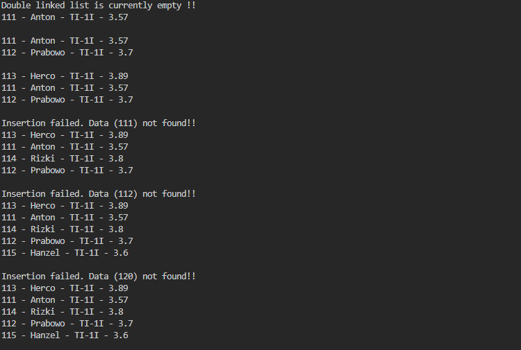
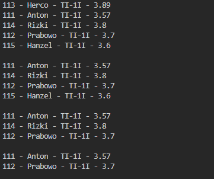
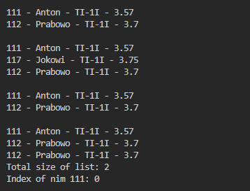

Experiment 1

12.2.1 Activity 1

Student1 :

public class Student1 {

    String nim, name, className;
    double gpa;

    public Student1() {
    }

    public Student1(String nm, String nama, String kls, double ip) {
        nim = nm;
        name = nama;
        className = kls;
        gpa = ip;
    }

    void print() {
        System.out.println(nim + " - " + name + " - " + className + " - " + gpa);
    }
}

Node : 

public class Node {

    Student1 data;
    Node next;
    Node prev;

    public Node() {
    }

    Node(Student1 data) {
        this.data = data;
        prev = null;
        next = null;
    }

//added prev and next since it's DoubleLinkedList
    Node(Node prev, Student1 data, Node next) { 
        this.data = data;
        this.prev = prev;
        this.next = next;
    }
}

12.2.2 Output Verification

12.2.3 Questions

1. Explain the difference between a singly linked list and a doubly linked list.

2. Observe the Node class, which contains the attributes next and prev. What are the
purposes of these attributes?

3. Examine the constructor in the DoubleLinkedLists class. What is the purpose of this
constructor?

    DoubleLinkedLists(){
        head = null;
        tail = null;
    }

4. In the addFirst() method, what is the meaning of the following code?

if(isEmpty()){
        head = tail = newNode;
    }

5. In the addFirst() method, what does the statement head.prev = newNode mean?

6. In the insertAfter() method, what is the meaning of current.next.prev = newNode?

7. In the experiment 1 code, in which method the traversal process implemented? What is
the meaning of temp = temp.next ?

8. In the insertAfter() method, what is the following code for?

if(temp == tail){
    addLast(data);
    }

Do we have to implement it? What if we remove it?

9. In the insertAfter() what is this statement if(temp.data.nim.equalsIgnoreCase(key)) for?

Answer : 

1. A single linked list is a structure where each node only knows about the node that comes after it, it can only move forward through the list. In contrast, a double linked list has each node connected to both its next and previous nodes and have a two-way connection that allows to navigate both forward and backward through the list.

2. The next attribute in a node points to the next node in the list, while prev points to the previous node.

3. The constructor initializes the list by setting both head and tail to null.The list starts off empty, with no nodes.

4. addFirst() usage is to checks the first on the list whether the list is empty. If it empty, it sets both head and tail to the newly created node.

5. This line ensures that the old head node now has its prev pointer correctly pointing to the new node that we just inserted at the front. It keeps the backward link intact.

6. This line updates the previous pointer of the node that comes after the newly inserted node. It makes sure the backward link from the next node leads correctly to the new node, maintaining consistency in the list’s structure.    

7. Traversal takes place in the print() method, It uses a temporary node called temp, starting at the head, The line temp = temp.next means the program moves to the next node each time through the loop, allowing it to process every node in the list from start to end.

8. This condition checks whether the node we want to insert after is the last node in the list. If it is, the method calls addLast() to properly insert the new node at the end.

9. This line checks whether the current node’s nim value matches the provided key, ignoring case differences.

Experiment 2

12.3.1 Labs Activities

added
   void removeFirst() {
        if (isEmpty()) {
            System.out.println("Double linked list is currently empty !!");
        } else if (head == tail) {
            head = tail = null;
        } else {
            head = head.next;
            head.prev = null;
        }
    }

    void removeLast() {
        if (isEmpty()) {
            System.out.println("Double linked list is currently empty !!");
        } else if (head == tail) {
            head = tail = null;
        } else {
            tail = tail.prev;
            tail.next = null;
        }
    }

    void remove(int index) {
        if (isEmpty()) {
            System.out.println("Double linked list is currently empty !!");
        } else if (index == 0) {
            removeFirst();
        } else {
            Node temp = head;
            for (int i = 0; i < index; i++) {
                temp = temp.next;
            }
            if (temp == tail) {
                removeLast();
            } else {
                temp.prev.next = temp.next;
                temp.next.prev = temp.prev;
            }
        }
    }

to DoubleLinkedList.java

added 
        dll.print();

        dll.removeFirst();
        dll.print();

        dll.removeLast();
        dll.print();

        dll.remove(1);
        dll.print();

to DoubleLinkedListsMain.java

12.3.2 Output Verification

12.3.3 Questions

1. What is the use of the following statement in the removeFirst() method?

head = head.next;
head.prev = null;

2. Why is it important to include conditions and processes like the ones below in both
removeFirst() and removeLast() methods? Explain!

else if(head == tail){
    head = tail = null;
    }

3. In the removeLast() method, if there is no tail attribute inside DoubleLinkedLists
class, what approach or changes need to be made to the code of the method?

4. What is the purpose of the initial if(isEmpty()) check in the remove(int index)
method?

5. Explain how the method handles the removal of a node at the beginning (index == 0) and at the end (temp == tail) of the linked list.

6. Describe how the method updates the links between nodes when removing a node
from the middle of the linked list.

7. The remove(int index) method currently does not check for negative index or index
that exceed the size of the DoubleLinkedLists. Please add statements to handle these
cases.

Answer : 

1. The line head = head.next; head.prev = null; moves the head to the next node and clears the backward link, fully detaching the removed node from the list.

2. The condition head == tail detects when there is only one node. In this case, both head and tail are set to null to empty the list and prevent dangling references.

3. Without the tail attribute, the method must traverse from the head to find the last node and its previous node, making removal of the last node slower (O(n)) instead of constant time (O(1)).

4. The isEmpty() check ensures there is at least one node before removal. Without this check, removing from an empty list would cause a null pointer exception.

5. When index == 0, the method calls removeFirst() to delete the head. If the target node is the last (temp == tail), it calls removeLast() to update the tail and detach the last node.

6. Removing a node from the middle involves updating the next pointer of the previous node and the prev pointer of the next node, effectively bypassing the node to be removed.

7. The following check is added at the start of remove(int index) to prevent invalid access:

   if (index < 0 || index >= size) {
       System.out.println("Index out of bounds!");
       return;
   }

Assignment : 

Double Linkedlist Main : 

added

        dll.print();

        dll.removeFirst();
        dll.print();

        dll.removeLast();
        dll.print();

        dll.remove(1);
        dll.print();

        dll.add(new Student1("117", "Jokowi", "TI-1I", 3.75), 1);
        dll.print();

        dll.removeAfter("111");
        dll.print();

        Student1 first = dll.getFirst();
        if (first != null) {
            first.print();
        }

        Student1 last = dll.getLast();
        if (last != null) {
            last.print();
        }

        Student1 mid = dll.getIndex(1);
        if (mid != null) {
            mid.print();
        }

        System.out.println("Total size of list: " + dll.getSize());

        String searchKey = "111";
        int foundIndex = dll.indexOf(searchKey);
        if (foundIndex != -1) {
            System.out.println("Index of nim " + searchKey + ": " + foundIndex);
        } else {
            System.out.println("Data with nim " + searchKey + " not found.");
        }
    }
}

Double Linkedlist : 

added 

   void add(Student1 data, int index) {
        if (index < 0 || index > getSize()) {
            System.out.println("Index out of bounds!");
            return;
        }
        if (index == 0) {
            addFirst(data);
            return;
        }
        Node newNode = new Node(data);
        Node temp = head;
        for (int i = 0; i < index - 1; i++) {
            temp = temp.next;
        }
        newNode.next = temp.next;
        if (temp.next != null) {
            temp.next.prev = newNode;
        } else {
            tail = newNode;
        }
        temp.next = newNode;
        newNode.prev = temp;
    }

    void removeAfter(String key) {
        Node temp = head;
        while (temp != null) {
            if (temp.data.nim.equalsIgnoreCase(key)) {
                if (temp.next != null) {
                    if (temp.next == tail) {
                        removeLast();
                    } else {
                        temp.next = temp.next.next;
                        if (temp.next != null) {
                            temp.next.prev = temp;
                        }
                    }
                }
                return;
            }
            temp = temp.next;
        }
    }

    Student1 getFirst() {
        return isEmpty() ? null : head.data;
    }

    Student1 getLast() {
        return isEmpty() ? null : tail.data;
    }

    Student1 getIndex(int index) {
        if (index < 0 || index >= getSize()) {
            return null;
        }
        Node temp = head;
        for (int i = 0; i < index; i++) {
            temp = temp.next;
        }
        return temp.data;
    }

    int getSize() {
        int count = 0;
        Node temp = head;
        while (temp != null) {
            count++;
            temp = temp.next;
        }
        return count;
    }

    int indexOf(String key) {
        Node temp = head;
        int index = 0;
        while (temp != null) {
            if (temp.data.nim.equalsIgnoreCase(key)) {
                return index;
            }
            temp = temp.next;
            index++;
        }
        return -1;
    }
}

Result : 

